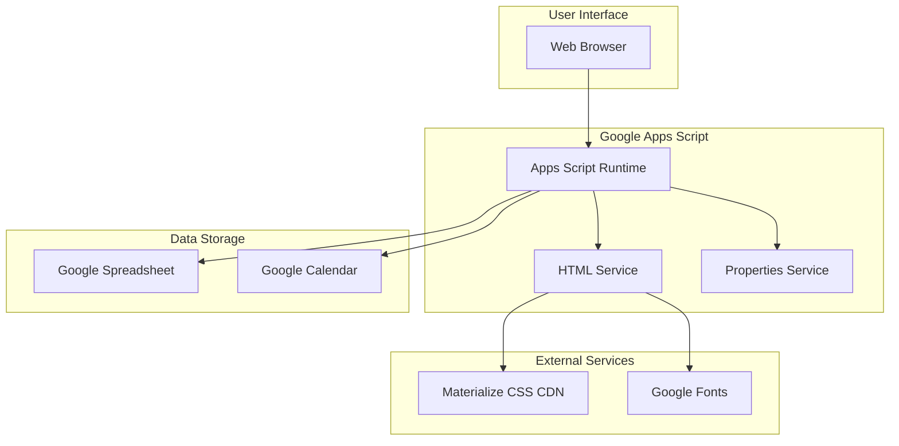
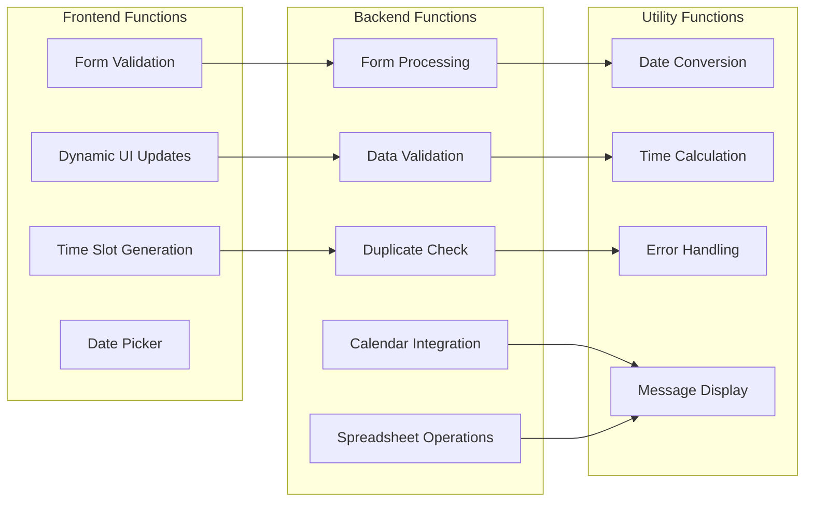
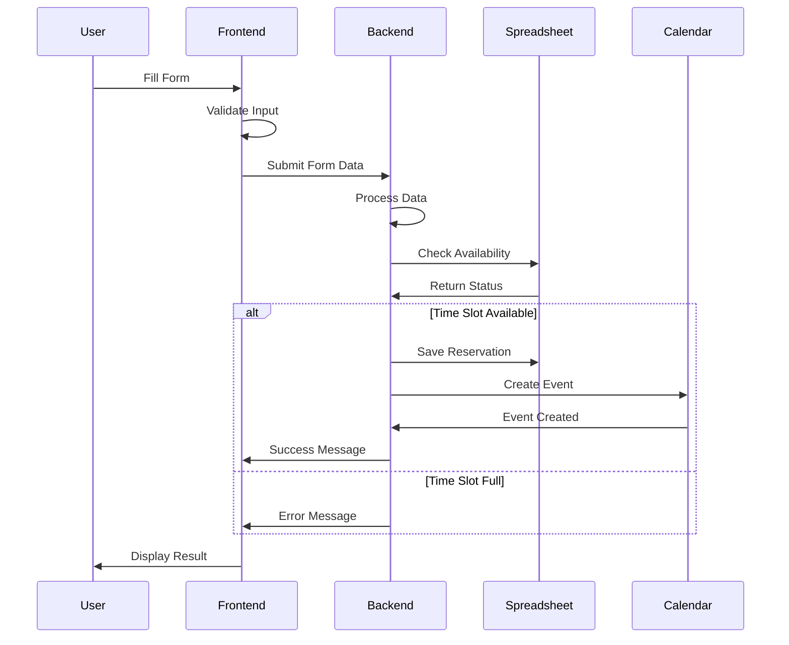
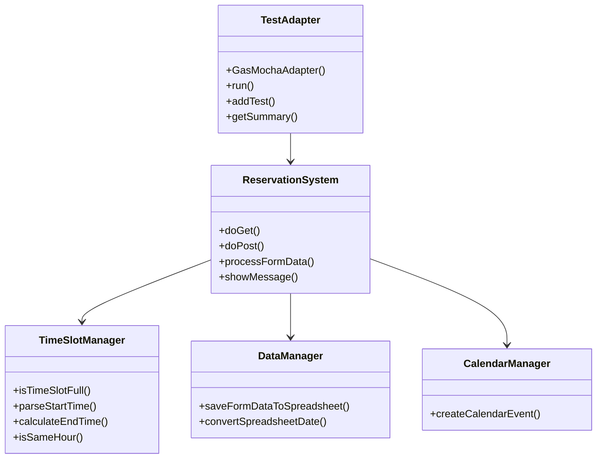
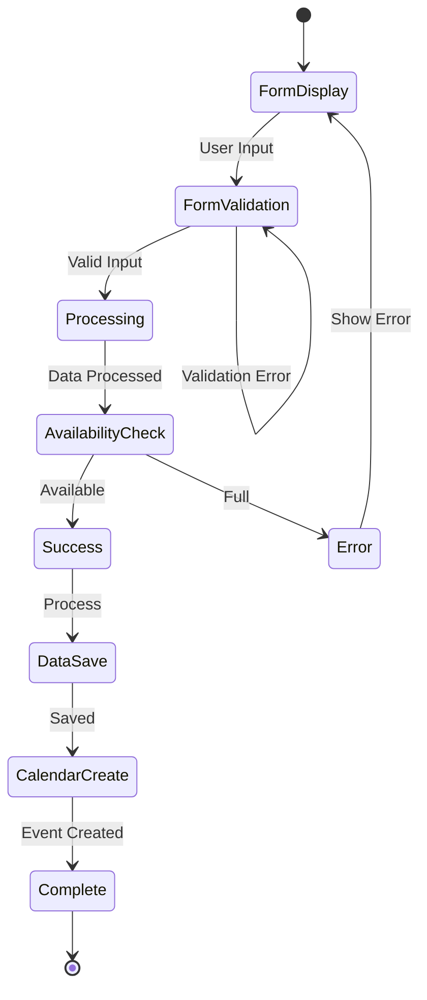
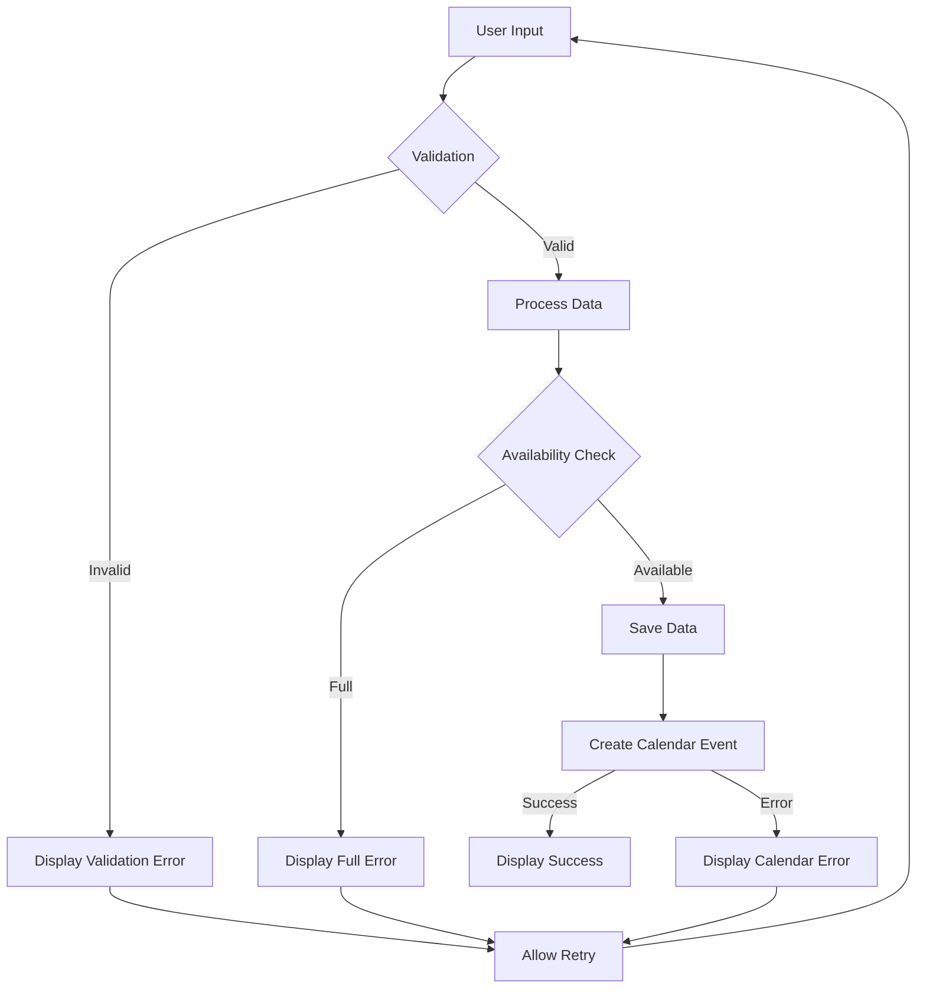
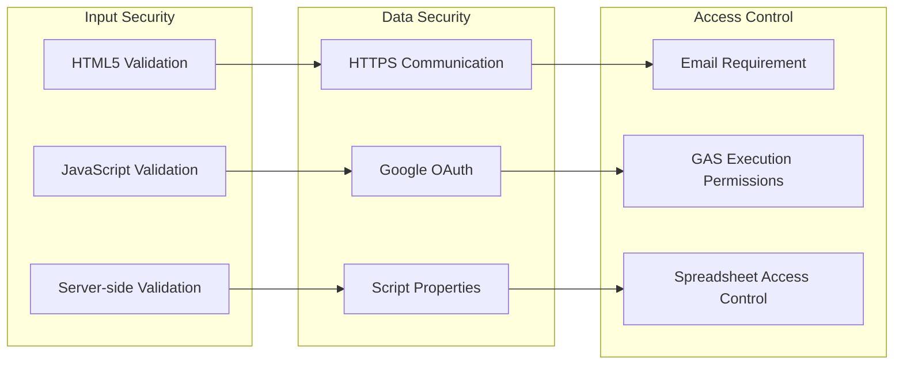
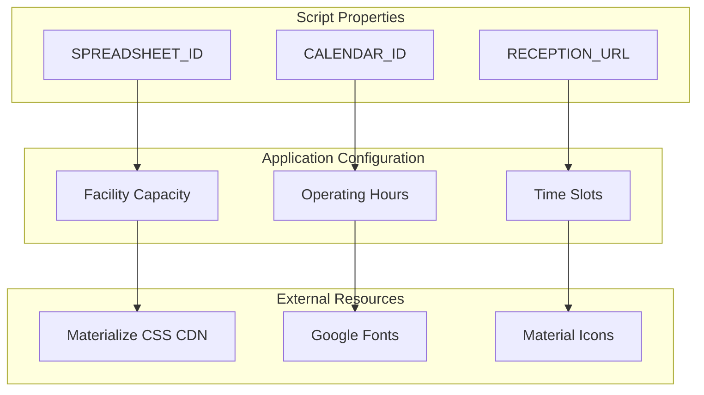
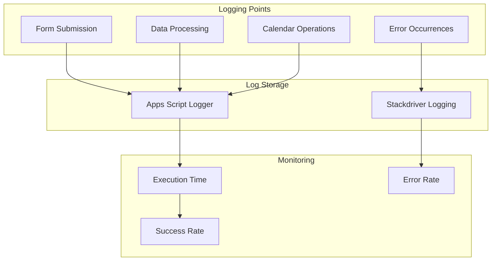

# Tri-force Koenji施設予約システム アーキテクチャ図

## 1. システム全体構成図



## 2. 機能構成図



## 3. データフロー図



## 4. クラス構成図



## 5. 状態遷移図



## 6. エラーハンドリング構成



## 7. テスト構成図

```mermaid
graph TB
    subgraph "Test Framework"
        ADAPTER[GasMochaAdapter]
        DESCRIBE[describe() functions]
        IT[it() test cases]
        ASSERT[assert() validations]
    end
    
    subgraph "Test Cases"
        TC1[parseStartTime Tests]
        TC2[isTimeSlotFull Tests]
        TC3[convertSpreadsheetDate Tests]
        TC4[calculateEndTime Tests]
    end
    
    ADAPTER --> DESCRIBE
    DESCRIBE --> IT
    IT --> ASSERT
    IT --> TC1
    IT --> TC2
    IT --> TC3
    IT --> TC4
```

## 8. セキュリティ構成



## 9. 設定管理構成



## 10. 監視・ログ構成


