# Tri-force Koenji 施設予約システム リアーキテクチャ設計書

| 項目 | 内容 |
|---|---|
| 対象 | [ando-front/tri-force-koenji-reservation](https://github.com/ando-front/tri-force-koenji-reservation) |
| 参照コミット | `c725d89`（2026-05-30 / main、コミット総数 73） |
| 現行構成 | Vite + React 18 SPA / Cloud Functions v2 (Express) / Firestore / Firebase Auth / Firebase Hosting |
| 目標構成 | Next.js 16 (App Router) / PostgreSQL (Supabase) / Drizzle ORM / Vercel |
| リアーキ動機 | ① Firebase 起因の保守性の悪さ　② 2026 年時点のアーキテクチャへのキャッチアップ |
| 成果物種別 | アーキテクチャ設計書（実装は次フェーズ） |
| 作成日 | 2026-07-25 |
| ステータス | ドラフト（レビュー用） |

---

## 0. この文書の位置づけ

現行リポジトリを `c725d89` 時点で読み込み、**実装レベルで課題を特定した上で**ターゲットアーキテクチャを設計している。第 3 章で挙げる不具合は本セッション中に Postgres 16 / Express 4 を実際に動かして再現確認したもので、第 6 章の定員制御 SQL も 10 並列の同時予約テストまで実行して検証済みである（結果は付録 B・C に記載）。

現行システムは「動いている」だけでなく、**設計としても素直**である。ドメインロジックが `functions/src/domain/` に分離され、Zod スキーマが `shared/types.ts` でフロント・バックエンド共有され、CI で型チェックとテストが回り、監査ログまである。小規模プロジェクトとしては十分に良い作りだ。本リアーキはこの構造の否定ではなく、**「良い構造が Firebase というランタイムの制約で本来の価値を出せていない」状態の解消**を目的とする。

---

### 図一覧

| 図 | 内容 | 掲載箇所 |
|---|---|---|
| 図1 | 現行アーキテクチャ（As-Is） | 2.1 |
| 図2 | ターゲットアーキテクチャ（To-Be） | 5.1 |
| 図3 | パッケージ間の依存方向 | 5.4 |
| 図4 | PostgreSQL データモデル（ER） | 6.1 |
| 図5 | 予約作成フロー — 定員・冪等性を DB が保証する | 6.2 |
| 図6 | 管理者認証フロー | 7 |
| 図7 | CI/CD パイプライン | 8.4 |
| 図8 | 移行フェーズと各段階の切り戻し手段 | 10.1 |

図は SVG（ベクター）で `docs/architecture/` に配置している。各図の下に折りたたみで Mermaid ソースを添えてあるため、仕様変更時はソースを編集して再書き出しすればよい。書き出しコマンドは付録 E に記載。

---

## 1. エグゼクティブサマリ

### 1.1 何が問題なのか

コミット履歴 73 件のうち、**機能開発ではなく Firebase / デプロイ基盤との格闘に費やされたコミットが 20 件以上**ある。

```
fix: make functions deployable in CI
fix: align functions entrypoint with build output
fix: make api function publicly invokable
fix: force functions deploy to set artifact cleanup policy
fix: remove facilities query index dependency
fix: 予約一覧用のFirestore複合インデックスを追加
fix: functions に zod を追加（shared/types.ts のビルドエラー修正）
fix: functions/tsconfig.json に zod パスマッピングを追加
fix: frontend/tsconfig.json に zod パスマッピングを追加
fix: vite.config.ts に zod alias を追加
Pipe runtime env vars into Cloud Functions v2 via .env file
Downgrade staging env-secret guards from fail-fast to warnings
Add staging diagnostic to surface which secret is missing
...
```

これは実装者の問題ではなく、**構成が抱える摩擦の記録**である。原因は 4 つに整理できる（第 3 章）。

1. **Firestore がスキーマレスであることのツケを、全読み取りパスの防御コードで払っている**（リポジトリ層 608 行のうち約 70 行が正規化コード）
2. **クエリ能力の不足を「全件取得してアプリ側で絞る」で回避している**（会員照会 1 回で通常 1,000・最悪 1,500 ドキュメント読み取り、監査ログは最大 5,000 件スキャン）
3. **業務上の不変条件（定員）を DB が保証できず、アプリコードに置くしかない**（結果として実際に定員超過が通る）
4. **モノレポでありながらワークスペース管理がなく、型共有が相対パス + 3 つの tsconfig + vite alias の手作業で成立している**

### 1.2 リアーキで何が変わるか

| 論点 | 現行 | リアーキ後 |
|---|---|---|
| 定員（人数）の保証 | アプリコード。**実際に超過が通る**（付録 B-1） | `CHECK` 制約。10 並列でも破れないことを検証済み |
| 二重送信 | 対策なし（レートリミットのみ） | `UNIQUE (facility_id, idempotency_key)` |
| 会員の予約照会 | 通常 1,000・最悪 1,500 ドキュメント読み取り | 1 インデックススキャン |
| スキーマ変更 | 手書き正規化関数を全読み取りパスに追加 | マイグレーションファイル 1 本 |
| 絞り込み検索 | 複合インデックスを事前定義 or 全件取得 | 任意の `WHERE` が書ける |
| デプロイ | Hosting は GitHub Action / Functions は CLI + 非推奨トークン + `.env` 生成 | `git push` のみ（Vercel） |
| プレビュー環境 | staging ワークフローを別途保守 | PR ごとに自動生成 |
| 型共有 | 相対パス `../../../shared/types` + 手動 alias 3 箇所 | pnpm workspace の `@tfk/core` |
| E2E テスト | なし | Playwright（予約フロー・二重送信・定員境界） |

### 1.3 コスト影響

月額 **0 〜 3,900 円**。現行（Blaze 従量、実質ほぼ無料）とほぼ同等で、Supabase を Pro（$25/月）にした場合のみ差額が出る。**リアーキの投資回収はコストではなく開発時間で行う**（第 11 章）。

---

## 2. 現行アーキテクチャ（As-Is）

### 2.1 構成


<p align="center"><sub>図1: 現行アーキテクチャ（As-Is）</sub></p>

<details><summary>この図の Mermaid ソース（編集用）</summary>

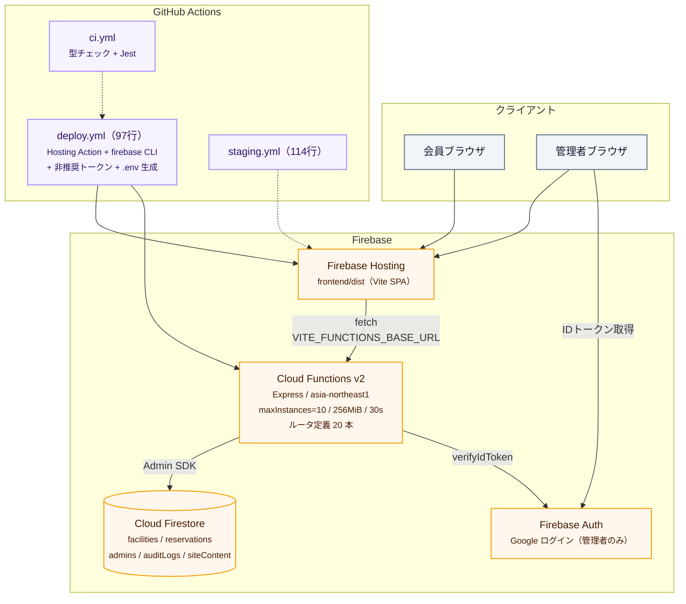

</details>

### 2.2 実装の現況（コード読解結果）

**リポジトリ構成**

```
frontend/   Vite 5 + React 18 + TS 5.5 + Tailwind 3 + react-router 6
            + TanStack Query 5 + react-hook-form + zod
functions/  Cloud Functions v2 + Express 4 + firebase-admin 12 + zod
            api/{reservations,facilities,availability,auditLogs,content,middleware}
            domain/{availability,ical,dashboardStats,date}  ← Jest テストあり
            infra/firestoreRepository.ts (608行)
shared/     types.ts (415行) — Zod スキーマ + 型定義をフロント/バックで共有
```

**規模**: TS/TSX/設定/ドキュメント合計 約 8,700 行。うち `AdminFacilityManagement.tsx` が 936 行の単一コンポーネント。

**API**（`functions/src/index.ts` の Express アプリ 1 本、`/api` として公開。ルータ定義は合計 **20 本**）

| メソッド | パス | 認証 | 本数 |
|---|---|---|---|
| GET | `/facilities`, `/availability`, `/content/usage-guide` | 不要 | 3 |
| POST | `/reservations` | 不要（IP レートリミット 10件/10分） | 1 |
| POST | `/reservations/lookup`, `/lookup/ical`, `/lookup-by-email`, `/lookup/cancel` | 不要（予約番号＋メール） | 4 |
| GET | `/reservations/admin`, `/admin/stats`, `/admin/:id`, `/admin/export`, `/facilities/admin`, `/audit-logs/admin`, `/content/admin/usage-guide` | 管理者 | 7 |
| POST / PATCH / PUT / DELETE | `/facilities/admin`, `/facilities/admin/:id`, `/reservations/admin/:id/status`, `/reservations/admin/:id`, `/content/admin/usage-guide` | 管理者 | 5 |

管理者認証は Firebase IDトークン検証 + `admins/{uid}` ドキュメントの存在チェック（`middleware.ts:18-48`）。

> `docs/設計書.md`（v2.0 / 2026年3月）の API 一覧は 11 本のままで、その後追加された会員セルフサービス系・ダッシュボード・監査ログ・利用案内 CMS が反映されていない。**設計書とコードが既に乖離している**点自体、ドキュメント運用の課題として記録しておく。

**評価できる点**（リアーキ後も継承する）

- ドメインロジック（スロット生成・営業時間判定・iCal 生成・ダッシュボード集計）が純関数として `domain/` に分離され、Jest テストが 3 ファイル存在する
- Zod スキーマをフロント・バックエンドで共有し、二重定義を避けている
- 監査ログ（`auditLogs`）が**予約の全状態遷移**（created / cancelled / status 更新 / deleted）と利用案内の更新に書き込まれている。ただし**施設マスタの作成・更新は `console.log` のみ**（`facilities.ts:46,78`）で、`AuditAction` 型にも施設系のアクションが定義されていない。定員・営業時間の変更は監査できない
- レートリミッタのコメントに「インスタンスごとに独立カウントなので厳密ではない」と限界が明記されている。設計判断が文書化されている
- `lookup-by-email` のセキュリティトレードオフが 20 行のコメントで明示的に記録されている

**現行の運用上の割り切り**

- 会員はログインしない（メール + 予約番号で本人確認）
- 確認メールは廃止済み（`#20`）。予約番号は画面表示のみ、控え忘れはメールアドレスで照会
- 空き状況グリッドに**他会員の氏名を公開表示**する仕様（README 明記）
- 予約は `pending` で作成され、`confirmed` へ遷移させる自動処理はない

---

## 3. 課題の構造分析

### 3.1 Firebase 起因の保守性問題（根本原因 4 つ）

#### 原因① スキーマレスのツケを読み取りパスで払っている

`firestoreRepository.ts` は 608 行のうち約 70 行（23-85 行の 63 行 + `sanitizeContentLines` 12 行）が正規化関数である。

```ts
// firestoreRepository.ts:23-85 — 抜粋
function normalizeDateList(value: unknown): string[] { ... }
function normalizeBlockedPeriods(value: unknown): BlockedPeriod[] { ... }
function normalizeWeekdayHours(value: unknown): WeekdayHours[] { ... }
function normalizeFacility(docId, data) {
  return {
    capacity: Number(data.capacity ?? 1),
    openHour: Number(data.openHour ?? 10),
    closeHour: Number(data.closeHour ?? 22),
    // ... 全フィールドにデフォルト値
  };
}
```

Firestore にはスキーマもマイグレーションもないため、**過去に書き込まれたあらゆる形のドキュメントに、読み取り時に毎回対応し続けなければならない**。`fix: add blockedPeriods normalization in firestoreRepository to fix CI type error` というコミットは、この構造から必然的に生まれる作業である。フィールドを 1 つ増やすたびに正規化関数が伸び、それが恒久的な負債として残る。

さらに深刻なのは `findReservationByCodeAndEmail` と `listActiveReservationsByEmail` に実装された **2 段構えのフォールバック**である。`emailLower` / `reservationCode` という非正規化フィールドを後から導入したため、旧データを救うために「新フィールドで検索 → 見つからなければ旧フィールドで検索」を全パスで実装している。RDB なら 1 本の `UPDATE` で済むデータ移行が、恒久的なコード分岐として固定されてしまった。

#### 原因② クエリ能力の不足を「全件取得＋アプリ側フィルタ」で回避している

```ts
// firestoreRepository.ts:303-343 — コメントがそのまま構造的制約の告白になっている
// 「複合インデックス回避」のため Firestore 側では絞り込みなしで取得し、
//  フィルタ後に hardLimit を厳密適用する
const FETCH_BATCH = 500;
const primary       = await ...where('emailLower','==',x).limit(500).get();
const fallbackSnaps = await Promise.all(candidates.map(c => ...where('email','==',c).limit(500).get()));
```

会員が自分の予約を照会する**主要導線 1 回で 1,000 ドキュメント**（`primary` 500 + フォールバック 500）を読み取る。入力メールに大文字が混在するとフォールバックが 2 本走り**最悪 1,500 ドキュメント**になる。監査ログ一覧では `MAX_AUDIT_LOG_SCAN = 5_000` 件をアプリ側でループしてフィルタしている。

```ts
// firestoreRepository.ts:546-593
const AUDIT_LOG_FETCH_BATCH = 200;
const MAX_AUDIT_LOG_SCAN    = 5_000;
while (matched.length < limit + 1 && scanned < MAX_AUDIT_LOG_SCAN && hasMoreInFirestore) { ... }
```

これは実装が悪いのではなく、**「等価フィルタ + 範囲 + orderBy の組み合わせごとに複合インデックスを事前定義しなければならない」という Firestore の制約に対する、最も現実的な回避策**である。SQL なら `WHERE action = $1 AND actor = $2 ORDER BY timestamp DESC LIMIT 50` の 1 行で、インデックス定義もアプリ側ループも不要になる。

コスト面でも、データ量が増えるほど読み取り課金が線形に増える。無料枠 50,000 read/日に対し、会員照会 1 回 = 1,000 read（最悪 1,500）なので、**照会が 1 日 50 回（最悪 33 回）を超えると無料枠を割る**計算になる。実際の読み取り数は該当メールの予約件数に依存するため常に上限に張り付くわけではないが、**「照会 1 回のコストがデータ量に比例して増える」構造そのもの**が問題である。

#### 原因③ 業務上の不変条件を DB が保証できない

定員チェックは Firestore トランザクション内のアプリコードにある。

```ts
// firestoreRepository.ts:168-196
await db().runTransaction(async (tx) => {
  const conflictSnap = await tx.get(/* 同一施設・同一日・同一開始時刻の pending/confirmed */);
  const capacity = facilitySnap.data()?.capacity ?? 0;
  if (conflictSnap.size >= capacity) {           // ← 件数を数えている
    throw ... 'CAPACITY_EXCEEDED';
  }
  tx.set(reservationRef, { ...data });
});
```

**`capacity` は設計書上「同時予約上限人数」なのに、`conflictSnap.size`（予約レコード件数）と比較している。** 各予約は `participants`（参加人数、最大 100）を持つため、定員 10 名の施設に「5 名 × 3 件 = 15 名」が入る。実際に付録 B-1 で再現した。

問題の本質は「バグがある」ことではなく、**この不変条件を DB 側で表明する手段が Firestore にない**ことである。だから：

- 不変条件はアプリコードの 1 箇所に暗黙的に存在する
- 別の書き込みパス（管理画面からの代理登録、データ修正スクリプト、Firestore コンソール手作業）を追加したとき、誰もそれを守ってくれない
- レビューでしか検出できない

`capacity ?? 0` のフォールバックも罠になっている。施設ドキュメントの読み取りに失敗すると `capacity = 0` となり `size >= 0` が常に真なので、**全予約が「満員」で拒否される**。フェイルクローズではあるが、原因が分からない障害になる。

#### 原因④ モノレポなのにワークスペース管理がない

`shared/types.ts` は `functions` から `'../../../shared/types'`、frontend から `'@shared/types'` で参照されている。これを成立させるために必要だった作業が、コミット 4 連発として残っている。

```
bf4f0b4 fix: functions に zod を追加（shared/types.ts のビルドエラー修正）
a70b897 fix: functions/tsconfig.json に zod パスマッピングを追加
d55eb61 fix: frontend/tsconfig.json に zod パスマッピングを追加
1256903 fix: vite.config.ts に zod alias を追加
```

`functions` と `frontend` が別々の `package.json` / `package-lock.json` を持ち、zod のバージョンも `^3.25.76` と `^3.23.8` で揃っていない。**共有型が両者で異なる zod でコンパイルされうる**状態である。pnpm workspace / Turborepo を使えば構造的に起きない。

#### そのほかの Firebase 固有の摩擦

| 事象 | コミット / 箇所 | 内容 |
|---|---|---|
| デプロイ経路の二重化 | `deploy.yml` | Hosting は `FirebaseExtended/action-hosting-deploy`、Functions は `npm i -g firebase-tools` + `--token`（`firebase login:ci` トークンは非推奨） |
| 環境変数の受け渡し | `deploy.yml:76-89` | ランタイム env を渡すために CI 内で `.env.<projectId>` を生成する必要がある。コメントに「単に `env:` で渡すだけでは届かない」と明記 |
| エントリポイント | `8464800` | `main: "lib/functions/src/index.js"` — tsconfig の出力構造に引きずられた不自然なパス |
| 公開設定 | `1970068` | `invoker: 'public'` を明示するまで公開 API が呼べない |
| ビルド成果物 | `b6e36cc` | artifact cleanup policy を設定するための強制デプロイ |
| レートリミット | `middleware.ts:64-107` | インメモリなのでインスタンス数（最大 10）倍まで通り得る。コメントで自認 |
| コールドスタート | 構成上 | 会員が最初に触る `GET /facilities` が Cloud Functions のコールドスタートを踏む。`api.ts:71-83` に「BASE_URL 誤設定時の直接 URL フォールバック」まで実装されている |

### 3.2 「最新アーキテクチャのキャッチアップ不足」の内訳

現行のライブラリ選定は 2024 年半ばの標準である。2026 年 7 月時点との差分を整理する。

| 領域 | 現行 | 2026 年時点の標準 | 差分の意味 |
|---|---|---|---|
| フレームワーク | Vite 5 + React 18 SPA + react-router 6 | **Next.js 16 App Router + React 19**（RSC / Server Actions） | SPA はデータ取得を全部クライアントで行うため、初回表示に「JS ロード → fetch → 描画」の 3 往復が必要。RSC ならサーバで描画済み HTML が返る |
| データ取得 | TanStack Query（クライアント fetch） | RSC で直接 DB アクセス + `Suspense` | API 層を経由しないので型が途切れず、ウォーターフォールが消える |
| フォーム | react-hook-form + fetch | Server Actions + `useActionState` | プログレッシブエンハンスメント。JS 無効でも動く |
| CSS | Tailwind 3 | **Tailwind 4**（CSS-first config、Oxide エンジン） | 設定が CSS 側に移り、ビルドが数倍速い |
| バリデーション | zod 3（frontend/functions で版ズレ） | zod 4（単一ワークスペースで共有） | 型推論性能とバンドルサイズが改善 |
| DB アクセス | firebase-admin 直叩き + 手書き正規化 | **Drizzle ORM**（スキーマ = TS、マイグレーション自動生成） | スキーマが型の単一の源になり、正規化コードが消える |
| リポジトリ | 独立 package.json × 2 + 相対パス共有 | **pnpm workspace + Turborepo** | 依存バージョン統一、差分ビルド、タスクキャッシュ |
| Lint/Format | frontend は ESLint 8 (.eslintrc)。**functions は `lint` スクリプトがあるのに eslint 依存も設定ファイルも存在しない**（CI で functions の lint を回していないため露見していない）。Prettier 未導入 | **Biome**（or ESLint 9 flat config） | 単一バイナリ、10〜100 倍高速、設定 1 ファイル。ワークスペース全体に一律適用できる |
| テスト | Jest（functions のみ、3 ファイル） | **Vitest**（ドメイン）+ **Playwright**（E2E） | フロントとクリティカルフローが完全に無検証な現状を埋める |
| 監視 | Cloud Logging（`console.error` のみ） | **Sentry** + OpenTelemetry | 現状はエラーが起きても誰も気づかない |
| AI 協働 | — | `AGENTS.md` / `CLAUDE.md` によるリポジトリ規約の明文化 | Copilot / Claude が既に PR を出している（`#11`〜`#22`）ので、規約をファイル化する効果が大きい |

> ここで重要なのは「新しいから使う」ではなく、**現行の痛点に直接効くものを選ぶ**という点である。RSC は「初回表示が Functions のコールドスタート待ちになる」問題に効き、Drizzle は「正規化コードが増え続ける」問題に効き、pnpm workspace は「zod alias を 4 箇所に書いた」問題に効く。第 5 章の選定はすべてこの対応関係で説明する。

### 3.3 現行コードで確認した不具合（詳細は付録 B）

| # | 内容 | 影響 | 再現 |
|---|---|---|---|
| B-1 | 定員判定が**人数ではなく予約件数**を数えている | 定員 10 名の施設に 15 名以上入る | コード読解＋論理的に確定 |
| B-2 | `GET /reservations/admin/export` が `/admin/:id` にシャドウされている | **管理者の CSV エクスポートが機能していない**（404 or 401） | Express 4 で実行確認 |
| B-3 | 空き状況の「過去枠」判定が UTC で行われている | **既に過ぎた時間帯が最大 9 時間ぶん予約可能なまま表示される** | Node で再現確認 |
| B-4 | `pending` を自動失効させる仕組みがない | 放置された仮予約が定員を永久に占有する | 仕様上の欠落 |
| B-5 | 二重送信対策がない | 連打で同一内容の予約が複数作成される | 仕様上の欠落 |
| B-6 | 施設マスタの作成・更新が監査ログに残らない | 定員・営業時間を誰がいつ変えたか追跡できない | `facilities.ts:46,78` が `console.log` のみ |
| B-7 | `functions` の lint が実質実行されていない | 静的解析の網が半分しかかかっていない | `lint` スクリプトはあるが eslint 依存・設定なし、CI も未実行 |

> **B-2 と B-3 はリアーキを待たずに即修正すべき**。数行の変更で直る（付録 B に修正案）。

---

## 4. リアーキの設計原則

| 原則 | 内容 | 対応する課題 |
|---|---|---|
| **P1. 不変条件は DB に置く** | 定員・重複・冪等性をアプリコードではなく制約として宣言する。アプリのどこから書いても破れない | 原因③、B-1、B-5 |
| **P2. スキーマを単一の源にする** | Drizzle のスキーマ定義から型・マイグレーション・バリデーションを導出。読み取り時の防御コードを不要にする | 原因① |
| **P3. クエリは DB に任せる** | 絞り込み・並び替え・ページングを SQL で表現する。アプリ側の全件ループを廃止 | 原因② |
| **P4. ドメイン層を持ち込む** | 既存の `domain/` は資産。フレームワーク非依存の純関数として `packages/core` に移し、テストごと引き継ぐ | 継承 |
| **P5. 時刻は 1 箇所で扱う** | JST 依存の計算を `packages/core/time.ts` に集約し、UTC/JST の混在をテストで固定する | B-3 |
| **P6. デプロイは `git push` だけ** | プレビュー環境を含めてプラットフォームに任せ、CI からデプロイ手順を消す | 原因④・デプロイ摩擦 |
| **P7. 運用の割り切りは維持する** | 「会員ログインなし」「氏名公開」「確認メールなし」は運用判断として尊重する。技術移行と仕様変更を混ぜない | スコープ管理 |

> **P7 が最も重要**。リアーキで仕様も変えると、不具合が「移行ミス」なのか「仕様変更」なのか切り分けられなくなる。仕様変更は移行完了後に別フェーズで扱う（第 12 章）。

---

## 5. ターゲットアーキテクチャ（To-Be）

### 5.1 全体構成


<p align="center"><sub>図2: ターゲットアーキテクチャ（To-Be）</sub></p>

<details><summary>この図の Mermaid ソース（編集用）</summary>

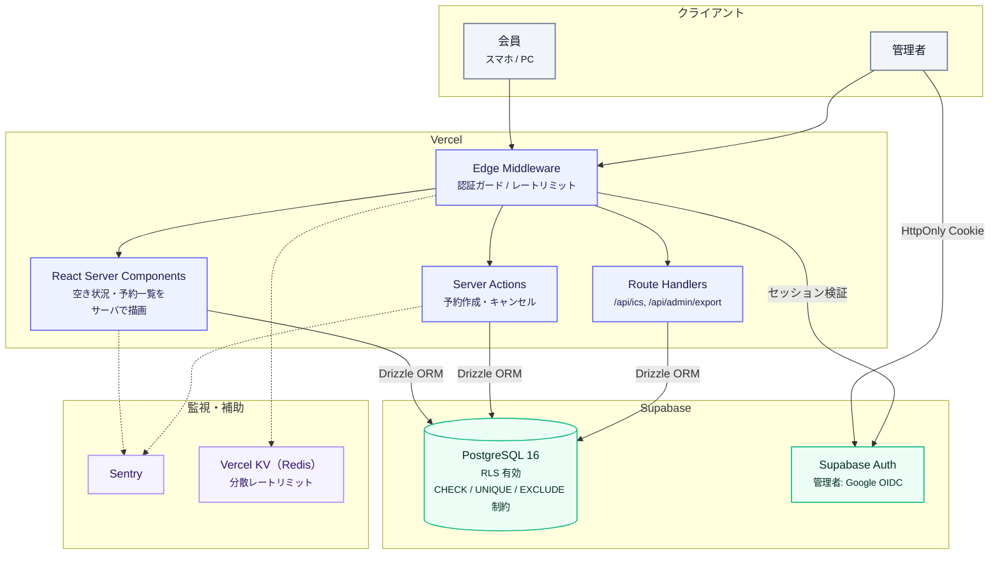

</details>

### 5.2 技術選定

| 層 | 採用 | 選定理由（現行のどの痛点に効くか） | 代替案と却下理由 |
|---|---|---|---|
| フレームワーク | **Next.js 16 (App Router)** | RSC により空き状況をサーバで描画 → 現行の「コールドスタート後に fetch」を 1 往復に短縮。Server Actions でフォーム送信の API 層が消える | Remix / TanStack Start：良いが Vercel との統合と日本語圏の情報量で劣る。SPA 維持：初回表示の構造的な遅さが残る |
| ランタイム | **Node.js 22 on Vercel** | Functions v2 の `invoker` / `maxInstances` / エントリポイント問題が消える | Cloudflare Workers：Node API 互換の落とし穴を検証するコストが見合わない |
| DB | **PostgreSQL 16（Supabase）** | `CHECK` / `EXCLUDE` / `UNIQUE` で不変条件を宣言でき、任意の `WHERE` が書ける。原因①②③をまとめて解消 | Firestore 継続：原因①②③が残る。PlanetScale (MySQL)：範囲型・EXCLUDE がなく定員制御を書きづらい |
| DB アクセス | **Drizzle ORM** | スキーマ定義（TS）→ マイグレーション自動生成 → 型推論。SQL に近く RLS と併用しやすい。手書き正規化コードが不要になる | Prisma：優秀だが生成クライアントが重く、RLS 併用時に `$queryRaw` 依存が増える。素の SQL：型が途切れる |
| 認証 | **Supabase Auth（Google OIDC）** | 管理者認証のみという現行スコープを維持。`admins` テーブル参照も RLS で表現できる | Firebase Auth 併用：2 ベンダーにまたがる認証は保守性を悪化させる。Auth.js：Supabase RLS との統合に一手間 |
| リポジトリ | **pnpm workspace + Turborepo** | zod alias 4 箇所問題、依存バージョン不整合を構造的に解消。差分ビルドで CI が速くなる | npm workspaces：可。Turborepo のキャッシュが効くので pnpm を選ぶ |
| UI | **Tailwind CSS 4 + shadcn/ui** | 現行の Tailwind 3 から素直に移行できる。936 行の `AdminFacilityManagement` を分割する足場になる | MUI：バンドルが重く既存スタイルと不整合 |
| スキーマ検証 | **zod 4**（`packages/core` で単一定義） | 現行の `shared/types.ts` の思想をそのまま継承。版ズレが起きなくなる | valibot：軽量だが既存資産の書き換え量が増える |
| Lint / Format | **Biome** | ESLint 8 の `.eslintrc` から移行。単一設定・高速 | ESLint 9 flat config：可。設定ファイルを減らせる Biome を選ぶ |
| テスト | **Vitest**（ドメイン）+ **Playwright**（E2E） | 既存 Jest テストは Vitest にほぼ無改造で移植可。E2E で B-1/B-2/B-3 のような不具合を CI で捕まえる | Jest 継続：ESM 対応と速度で Vitest に劣る |
| 監視 | **Sentry** + Vercel Analytics | 現行は `console.error` のみで障害に気づけない | Cloud Logging 継続：Vercel に移るので不整合 |
| レートリミット | **Vercel KV + `@upstash/ratelimit`** | 現行のインメモリ実装（インスタンス数倍まで通る問題）を解消 | インメモリ継続：同じ問題が残る |
| AI 協働規約 | **`AGENTS.md` / `CLAUDE.md`** | Copilot / Claude が既に PR を出しているため、規約を明文化すると生成物の品質が安定する | — |

> **バージョン根拠**: Next.js は 2026 年 6〜7 月時点で 16.2 系が安定版。Supabase は Free（DB 500MB / MAU 5万 / **1 週間非アクティブで一時停止** / バックアップなし）と Pro（$25/月 / DB 8GB / 日次バックアップ 7 日保持）。

### 5.3 リポジトリ構成

```
tri-force-koenji-reservation/
├── apps/
│   └── web/                          # Next.js 16 — 会員 + 管理画面を 1 アプリに統合
│       ├── app/
│       │   ├── (public)/
│       │   │   ├── page.tsx                  # 空き状況 + 予約（RSC）
│       │   │   ├── guide/page.tsx
│       │   │   ├── complete/page.tsx
│       │   │   └── my-reservation/page.tsx
│       │   ├── (admin)/admin/
│       │   │   ├── page.tsx                  # ダッシュボード
│       │   │   ├── reservations/…
│       │   │   ├── facilities/…              # ← 936行を機能単位に分割
│       │   │   ├── audit-logs/page.tsx
│       │   │   └── content/page.tsx
│       │   ├── api/
│       │   │   ├── ics/route.ts              # iCal
│       │   │   └── admin/export/route.ts     # CSV（B-2 の再発を構造的に防ぐ）
│       │   └── actions/                      # Server Actions
│       │       ├── create-reservation.ts
│       │       └── cancel-reservation.ts
│       ├── components/
│       └── middleware.ts                     # 認証ガード / レートリミット
│
├── packages/
│   ├── core/                         # ★ フレームワーク非依存の業務ロジック
│   │   ├── schema/                   #   zod スキーマ（旧 shared/types.ts）
│   │   ├── availability.ts           #   旧 domain/availability.ts をそのまま移植
│   │   ├── ical.ts
│   │   ├── dashboard-stats.ts
│   │   ├── time.ts                   #   ★ JST 変換を集約（B-3 の根治）
│   │   └── *.test.ts                 #   旧 Jest テストを Vitest へ
│   └── db/                           # Drizzle スキーマ + マイグレーション + クエリ
│       ├── schema.ts
│       ├── migrations/
│       └── queries/
│
├── e2e/                              # Playwright
├── pnpm-workspace.yaml
├── turbo.json
├── biome.json
├── AGENTS.md                         # AI エージェント向けリポジトリ規約
└── docs/
    ├── 設計書.md
    ├── 運用手順書.md
    └── adr/                          # Architecture Decision Records
```

**設計意図**

- `packages/core` は **DB もフレームワークも知らない**。現行の `functions/src/domain/` がすでにこの性質を満たしているため、テストごとそのまま移植できる。リアーキの中で最もリスクが低い部分
- `packages/db` にスキーマとクエリを閉じ込め、`apps/web` は Drizzle の型を通してのみ DB に触る
- 会員アプリと管理画面を 1 つの Next.js アプリに統合し、ルートグループ `(public)` / `(admin)` で分ける。現行の SPA でも実質同一バンドルなので変更ではなく明示化

### 5.4 レイヤ間の依存方向


<p align="center"><sub>図3: パッケージ間の依存方向</sub></p>

<details><summary>この図の Mermaid ソース（編集用）</summary>

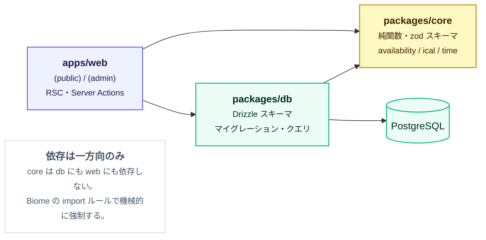

</details>

`core` は何にも依存しない。この一方向依存を Biome の import ルールで機械的に強制する。

---

## 6. データモデル

### 6.1 ER 図


<p align="center"><sub>図4: PostgreSQL データモデル（ER）</sub></p>

<details><summary>この図の Mermaid ソース（編集用）</summary>

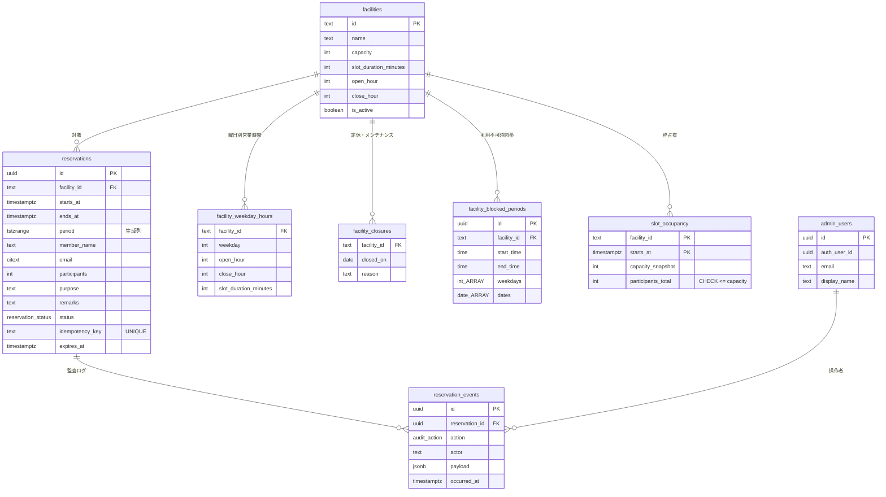

</details>

**現行 Firestore との対応**

| Firestore | PostgreSQL | 変更点 |
|---|---|---|
| `facilities`（配列フィールド内包） | `facilities` + 3 子テーブル | `weekdayHours` / `maintenanceDates` / `blockedPeriods` を正規化。手書き正規化関数が不要になる |
| `reservations` | `reservations` + `slot_occupancy` | 期間を `tstzrange` 生成列に。定員制御を専用テーブルへ |
| `admins` | `admin_users` | 変更なし |
| `auditLogs` | `reservation_events` | 変更なし（`actor` / `payload` / `occurred_at`） |
| `siteContent/usage-guide` | `site_content` | 変更なし |

> `date` + `startTime`（文字列）を `timestamptz` に変えるのが移行の要点。文字列比較でソート・範囲検索していた箇所がすべて型安全な時刻演算になる。

### 6.2 定員制御 — 現行の弱点を根治する

**課題**（原因③ / B-1）: 定員は「人数」だが件数で数えている。かつ不変条件が DB に表明されていない。

**方針**: `EXCLUDE` 制約は「重ならない」を宣言できるが「合計が上限以下」は数えられない。そこで**スロット占有テーブルに人数合計を持たせ、`CHECK` 制約で上限を守る**。`CHECK` は他テーブルを参照できないため、施設定員のスナップショットを同テーブルに持つ。

```sql
create table slot_occupancy (
  facility_id        text        not null references facilities(id),
  starts_at          timestamptz not null,
  capacity_snapshot  int         not null check (capacity_snapshot > 0),
  participants_total int         not null default 0,
  primary key (facility_id, starts_at),
  constraint within_capacity check (participants_total <= capacity_snapshot)
);
```

予約作成は **1 トランザクション / 実質 1 ステートメント**で完結する。

```sql
-- 抜粋（全文は付録 C）
insert into slot_occupancy (facility_id, starts_at, capacity_snapshot, participants_total)
values (p_facility_id, p_starts_at, v_capacity, p_participants)
on conflict (facility_id, starts_at) do update
  set participants_total = slot_occupancy.participants_total + excluded.participants_total;
-- ↑ ON CONFLICT DO UPDATE が行ロックを取るため同時実行は直列化され、
--   定員超過は within_capacity 制約が 23514 で弾く

insert into reservations (...) values (...) returning id;
```

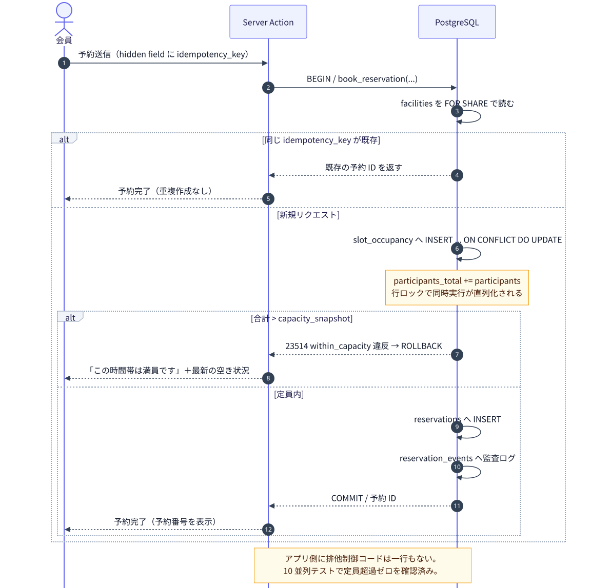

<p align="center"><sub>図5: 予約作成フロー — 定員・冪等性を DB が保証する</sub></p>

<details><summary>この図の Mermaid ソース（編集用）</summary>

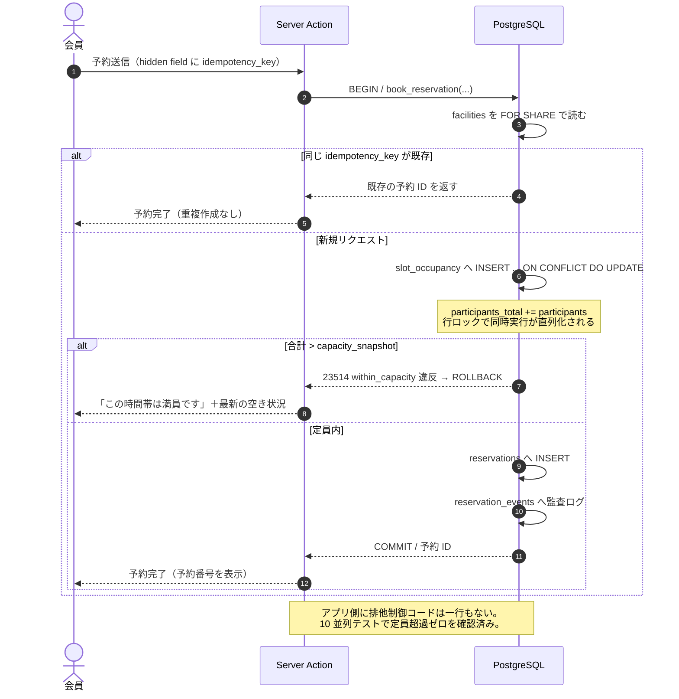

</details>

**検証結果**（Postgres 16.13 で実行、詳細は付録 C）

| テスト | 期待 | 結果 |
|---|---|---|
| 定員 10 名に 5 名 → 4 名 | 合計 9 名で成功 | ✅ |
| さらに 3 名（合計 12 名） | `within_capacity` 違反で拒否、占有は 9 名のまま | ✅ |
| 同一 `idempotency_key` を再送 | 新規作成されず既存 ID を返す（予約は 2 件のまま） | ✅ |
| キャンセル後の枠解放 | 9 → 4 名に戻る | ✅ |
| **10 並列で同一枠に 3 名ずつ** | 3 件（9 名）のみ成功、7 件拒否、超過なし | ✅ |

現行実装ではこのうち 2 件目以降のケースが通ってしまう。**アプリコードを 1 行も書かずに、DB が不変条件を守っている**点が本質的な違いである。

> **個室など定員 1 の排他資源**を将来追加する場合は、`EXCLUDE USING gist (facility_id WITH =, period WITH &&) WHERE (status = 'confirmed')` を併用する。`slot_occupancy` はスロット境界が固定の資源に、`EXCLUDE` は任意時間帯の資源に適した使い分けになる。

### 6.3 冪等性と仮予約の失効

```sql
-- 二重送信を DB で弾く（B-5）
constraint uniq_idempotency unique (facility_id, idempotency_key)
```

Server Action 側でリクエストごとに UUID を発行し、フォームの hidden field に埋める。連打・リトライ・ネットワーク再送のいずれでも同じキーが飛ぶため、2 回目以降は既存予約 ID を返して終了する。

仮予約の失効（B-4）は `expires_at` と Vercel Cron の組み合わせで扱う。

```sql
alter table reservations add column expires_at timestamptz;
-- status='pending' かつ expires_at < now() の行を Cron が cancelled にし、
-- slot_occupancy から人数を差し引く
```

> ただし現行運用では `pending` → `confirmed` の自動遷移がなく、実質すべての予約が `pending` のままである。**「pending の意味」を運用側と確定させる**のが前提（第 14 章のアクション項目）。確定運用がないなら、ステータスを `confirmed` / `cancelled` の 2 値に単純化する方が健全である。

### 6.4 認可（RLS）

現行の Firestore ルールは「予約は管理者のみ読める / 書き込みは Functions のみ」という素直な設計で、これを RLS に写す。ただし空き状況の公開は**個人情報を落としたビュー**経由に限定する。

```sql
alter table reservations enable row level security;

-- 会員は自分の予約のみ（将来のログイン制導入に備えたポリシー）
create policy member_reads_own on reservations for select
  using (member_id = (select id from members where auth_user_id = auth.uid()));

-- 空き状況は氏名・メール・備考を含まないビュー経由でのみ公開
create view v_busy_slots with (security_invoker = off) as
  select facility_id, starts_at, participants
    from reservations where status = 'confirmed';
```

**検証結果**: 会員 A のセッションで `reservations` を SELECT すると自分の 1 件のみが返り、`v_busy_slots` は個人情報なしで全 3 枠が返ることを確認済み（付録 C）。

> **現行仕様との関係**: README にあるとおり、現在は空き状況グリッドに**他会員の氏名を公開表示**している。これは運用判断なので P7 に従い移行時は維持する。ただし RLS + ビューの構成にしておけば、「氏名を隠す」という判断に切り替えるのがビュー定義 1 行の変更で済む。現行は Functions のレスポンス整形コードを追う必要がある。

### 6.5 スキーマ変更の運用

```
packages/db/
├── schema.ts              # ★ 単一の源
└── migrations/
    ├── 0001_init.sql      # drizzle-kit generate が自動生成
    └── meta/
```

`schema.ts` を編集 → `pnpm db:generate` でマイグレーション SQL が生成される → PR でレビュー → main マージで `drizzle-kit migrate` が実行される。

現行との対比：フィールドを 1 つ増やす作業が「`shared/types.ts` に追加 → `normalize*` 関数に追加 → 全読み取りパスを確認 → 必要なら複合インデックスを `firestore.indexes.json` に追加 → 旧データ用フォールバックを検討」から、「`schema.ts` に 1 行追加 → マイグレーション生成」になる。

---

## 7. 認証・認可

現行スコープ（管理者のみ認証、会員はログインしない）を維持する。

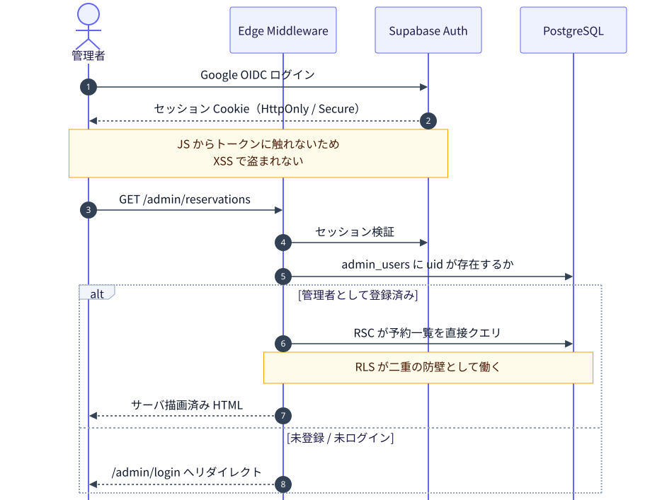

<p align="center"><sub>図6: 管理者認証フロー</sub></p>

<details><summary>この図の Mermaid ソース（編集用）</summary>

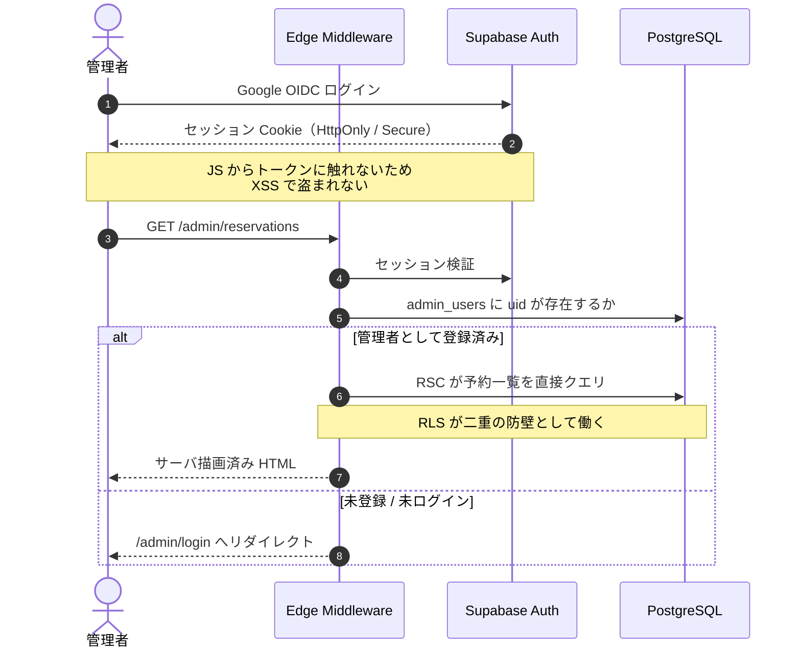

</details>

**現行からの改善点**

| 論点 | 現行 | リアーキ後 |
|---|---|---|
| トークン保持 | IDトークンを JS から `getIdToken()` で取得しヘッダに付与 | HttpOnly Cookie。XSS でトークンを盗まれない |
| 認可の実行位置 | 各エンドポイントで `requireAdmin` ミドルウェア | Edge Middleware で `/admin/*` を一括ガード＋RLS で二重防御 |
| CSV エクスポート | 呼び出し側は正しいが、サーバ側のルート定義順で `/admin/:id` に吸収され**404 で動作しない**（B-2） | Route Handler（`admin/export/route.ts`）+ Cookie 認証。ファイルシステムルーティングなので衝突しない |
| 管理者追加 | Firestore コンソールで手動作成 | `admin_users` への INSERT（管理画面 or マイグレーション） |

会員の本人確認（メール + 予約番号）はロジックを変えない。ただし `lookup-by-email` が「メールアドレスを知っていれば第三者が予約番号を取得しキャンセルまでできる」トレードオフを抱えている点は現行コードのコメントどおりであり、**リアーキとは独立に運用判断が必要**。移行では現状の挙動を維持する（第 12 章に改善案）。

---

## 8. アプリケーション層の設計

### 8.1 データ取得と更新の経路

| 用途 | 現行 | リアーキ後 |
|---|---|---|
| 空き状況表示 | クライアント fetch → Functions → Firestore | **RSC** が直接 `packages/db` を呼ぶ。1 往復 |
| 予約作成 | fetch POST → Express → Firestore トランザクション | **Server Action** → `book_reservation()` |
| 予約キャンセル | fetch POST | Server Action |
| 管理者一覧・絞り込み | fetch + TanStack Query | RSC + `searchParams`（URL が状態になる） |
| iCal / CSV | Express ルート | **Route Handler**（バイナリ・ヘッダ制御が必要なもののみ） |

Route Handler は「HTTP レスポンスそのものを制御したいもの」に限定する。これにより現行の 20 本のルータ定義が Server Action + Route Handler 2 本に集約され、**B-2 のようなルート定義順のバグが起きる余地自体がなくなる**（ファイルシステムルーティングなので `admin/export/route.ts` と `admin/[id]/route.ts` が衝突しない）。

### 8.2 時刻の扱い（B-3 の根治）

現行は日付・JST の計算が **6 箇所**に散っており、そのうち正しく JST を扱っているのは 2 箇所だけである。

```ts
// ① functions/src/domain/date.ts:2 — 正しい
export function todayJst(now = new Date()): string { ... }

// ② functions/src/api/availability.ts:31-33 — ①を使っていない（B-3 の原因）
const todayStr = now.toISOString().split('T')[0];         // UTC 日付
const nowMin   = now.getHours() * 60 + now.getMinutes();  // Cloud Functions は TZ=UTC

// ③ shared/types.ts:7 — UTC
function todayString(): string { return new Date().toISOString().split('T')[0]; }

// ④ frontend/src/pages/ReservationPage.tsx:12,19 — UTC
// ⑤ frontend/src/pages/MyReservationPage.tsx:39-40 — todayJst 相当を独自に再実装
const jst = new Date(now.getTime() + 9 * 60 * 60 * 1000);
// ⑥ frontend/src/pages/admin/AdminFacilityManagement.tsx:68 — UTC
```

**同じ「JST の今日」を求めるロジックが 2 通り実装され、4 箇所は UTC のまま**という状態である。フロントとバックエンドで日付の解釈が食い違うため、深夜帯（JST 00:00〜09:00）に画面とサーバの判定がずれる。

リアーキ後は `packages/core/time.ts` に集約し、以下を強制する。

1. **DB には `timestamptz` で保存する**（インスタント）。文字列日付＋文字列時刻の組み合わせをやめる
2. **JST の壁時計への変換は `time.ts` の関数経由のみ**。`new Date().getHours()` と `toISOString().split('T')[0]` の直接使用を Biome のルールで禁止し、**フロント・バックエンドの両方から同じ関数を呼ばせる**（現行はフロントに独自実装がある）
3. **「現在時刻」は引数で受け取る**（既存 `todayJst(now = new Date())` の作法を全体に広げる）。テストで時刻を固定できる
4. **DST のない JST 固定**なので `Asia/Tokyo` を定数化し、`Intl.DateTimeFormat` で変換する

```ts
// packages/core/time.ts（設計イメージ）
export const TZ = 'Asia/Tokyo' as const;
export function nowJstMinutes(now: Date): number { /* JST の 0:00 からの分 */ }
export function todayJst(now: Date): string { /* "YYYY-MM-DD" */ }
export function isSlotPast(slotStartsAt: Date, now: Date): boolean { /* 単純比較 */ }
```

`timestamptz` にすれば `isSlotPast` は `slotStartsAt <= now` の単純比較になり、**壁時計の分数を計算する必要がそもそも消える**。これが B-3 の構造的な解決である。

### 8.3 テスト戦略

| レイヤ | ツール | 対象 | 現行 |
|---|---|---|---|
| ドメイン | Vitest | スロット生成・営業時間・blockedPeriods・iCal・集計・時刻変換 | Jest 3 ファイル（移植可） |
| DB 制約 | Vitest + Testcontainers（or ローカル PG） | **定員境界・同時実行・冪等性・RLS** | なし |
| コンポーネント | Vitest + Testing Library | 予約フォーム・空き状況グリッド | なし |
| E2E | Playwright | 予約完了までの導線 / 連打で 1 件のみ / 定員満了時の表示 / CSV ダウンロード / 管理者ログイン | なし |

**CI で必ず落とすべきケース**（現行で実際に壊れていた/壊れているもの）

- 定員 10 名の枠に 5 名 × 3 件を投げて 3 件目が拒否されること（B-1）
- `/admin/export` が CSV を返すこと（B-2）
- JST 18:00 時点で 17:00 の枠が予約不可であること（B-3）
- 同じ冪等キーの二重送信で予約が 1 件だけ作られること（B-5）

### 8.4 CI/CD


<p align="center"><sub>図7: CI/CD パイプライン</sub></p>

<details><summary>この図の Mermaid ソース（編集用）</summary>

```mermaid
flowchart LR
  PR["Pull Request"]
  T["turbo run<br/>lint / typecheck / test<br/><small>差分パッケージのみ</small>"]
  PV["Vercel Preview<br/><small>PR ごとに自動生成</small>"]
  E2E["Playwright E2E<br/><small>Preview URL に対して実行</small>"]
  RV["レビュー"]
  MG["main へマージ"]
  MIG["drizzle-kit<br/>migrate"]
  PROD["Vercel Production<br/><small>自動デプロイ</small>"]

  PR --> T --> PV --> E2E --> RV --> MG --> MIG --> PROD

  classDef ci   fill:#f5f3ff,stroke:#a78bfa,stroke-width:1.5px,color:#2e1065
  classDef app  fill:#eef2ff,stroke:#6366f1,stroke-width:1.5px,color:#1e1b4b
  classDef data fill:#ecfdf5,stroke:#10b981,stroke-width:1.5px,color:#022c22
  class PR,T,E2E,RV,MG ci
  class PV,PROD app
  class MIG data
```

</details>

現行 `deploy.yml` の 97 行（Hosting Action + `npm i -g firebase-tools` + 非推奨トークン + `.env` ファイル生成 + `--force`）が、**マイグレーション実行ステップ 1 つ**に置き換わる。`staging.yml`（114 行）は Vercel Preview が担うため削除できる。

---

## 9. 非機能要件

| 分類 | 目標 | 実現手段 | 現行との差 |
|---|---|---|---|
| 初回表示 | 空き状況ページ LCP < 1.5s（モバイル 4G） | RSC + Vercel Edge のキャッシュ | 現行は Functions コールドスタート（数百ms〜数秒）後に fetch |
| 読み取り効率 | 会員照会 1 回 = 1 インデックススキャン | Postgres インデックス | 現行は 1,000（最悪 1,500）ドキュメント読み取り |
| 整合性 | 定員超過・二重予約が構造的に起きない | `CHECK` / `UNIQUE` / 行ロック | 現行はアプリコード依存（実際に破れる） |
| 可用性 | Vercel + Supabase の SLA に準拠 | マネージド | 同等 |
| 監視 | 未処理例外を 5 分以内に検知 | Sentry + Slack 通知 | 現行は `console.error` のみ。**気づく手段がない** |
| セキュリティ | 管理者トークンを JS から触らせない | HttpOnly Cookie + Edge ガード + RLS | 現行は JS が IDトークンを保持 |
| レートリミット | 全インスタンス横断で厳密 | Vercel KV | 現行はインスタンス数（最大10）倍まで通る |
| バックアップ | 日次・7 日保持 + PITR | Supabase Pro | Firestore は Blaze で日次エクスポート設定が必要（現状未設定と推測） |
| 個人情報 | 保持期間を定めて自動削除 | Vercel Cron で N 年経過分を匿名化 | 現行は無期限保持 |
| アクセシビリティ | WCAG 2.2 AA 相当 | shadcn/ui + Playwright の axe チェック | 未評価 |

---

## 10. 移行計画

### 10.1 段階

| Phase | 内容 | 期間目安 | 切り戻し |
|---|---|---|---|
| **0. 即時修正（リアーキ前）** | **B-2 / B-3 を現行コードで修正**（付録 B の差分）。B-1 を件数→人数合計に修正。B-6（施設変更の監査ログ）も併せて対応。回帰テストを 3 本追加 | 2〜3 日 | 通常のロールバック |
| **1. 基盤整備** | pnpm workspace 化、Turborepo、Biome、Vitest 移行。**この時点では Firebase 上で動き続ける**（構成だけモノレポ化） | 1 週 | 各 PR 単位 |
| **2. `packages/core` 抽出** | `functions/src/domain/` と `shared/types.ts` を `packages/core` へ移動。`time.ts` を新設し JST 計算を集約。テストごと移植 | 1 週 | 同上。振る舞いは不変 |
| **3. Postgres スキーマ + 二重書き込み** | Supabase 構築、Drizzle スキーマ、`book_reservation()` 実装。**Functions から Firestore と Postgres の両方に書く**。読み取りは Firestore のまま | 2 週 | Postgres 書き込みを止めるだけ |
| **4. データ移行と照合** | 既存 Firestore データを Postgres へ投入。日次で件数・内容を突合するバッチを回し、差分ゼロを確認 | 1 週 | 影響なし（読み取りは Firestore） |
| **5. Next.js アプリ構築** | `apps/web` を作り、Postgres を読んで画面を再現。**Vercel Preview で並行稼働**。本番 URL はまだ Firebase | 3 週 | 公開しないだけ |
| **6. 読み取り切替** | 本番ドメインを Vercel へ。Firestore への二重書き込みは維持 | 1 週 | DNS を Firebase に戻す |
| **7. Firebase 撤去** | 二重書き込み停止、Firestore をエクスポートしてアーカイブ、Functions / Hosting 削除 | 1 週 | 二重書き込み再開で復帰可能 |


<p align="center"><sub>図8: 移行フェーズと各段階の切り戻し手段</sub></p>

<details><summary>この図の Mermaid ソース（編集用）</summary>

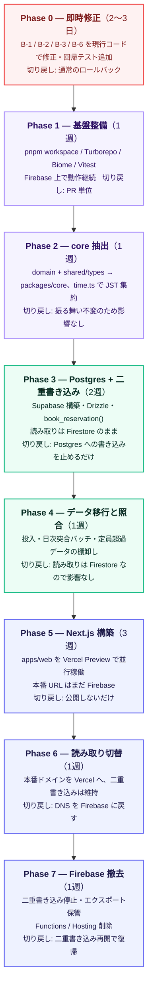

</details>

**合計約 10〜11 週**。Phase 3〜6 の間は常に Firebase 側が生きており、どの時点でも DNS 切り替えだけで戻せる。

> **Phase 0 を分離した理由**: B-2（CSV エクスポート不動）と B-3（過去枠が予約可能）は**本番で今まさに起きている**。リアーキ完了を待つ理由がない。また Phase 0 で回帰テストを書いておくと、Phase 5 の画面再現が正しいかを判定する基準になる。

### 10.2 データ移行

**変換の要点**

| Firestore | → | PostgreSQL | 注意点 |
|---|---|---|---|
| `date: "2026-08-01"` + `startTime: "10:00"` | → | `starts_at: timestamptz` | **JST として解釈**して変換。ここを UTC で読むと 9 時間ずれる |
| `facilities.weekdayHours[]` | → | `facility_weekday_hours` 行 | 配列を行に展開 |
| `facilities.maintenanceDates[]` | → | `facility_closures` 行 | 同上 |
| `facilities.blockedPeriods[]` | → | `facility_blocked_periods` 行 | `weekdays` / `dates` の相互排他は移行時に検証 |
| `reservations`（pending/confirmed） | → | `reservations` + `slot_occupancy` 再計算 | **既存データが定員を超過している可能性がある**（B-1 の帰結）。超過枠は制約違反になるので事前に洗い出して運用判断を仰ぐ |
| `auditLogs` | → | `reservation_events` | `actor` が `'system'` / `'member'` / uid の 3 種混在。そのまま維持 |
| `emailLower` / `reservationCode` | → | 不要 | `citext` 型と生成列で置き換え、フォールバック分岐を削除 |

**移行スクリプトの要件**

- 冪等（何度実行しても同じ結果）
- dev 環境で 3 回以上リハーサル
- **定員超過している既存枠のレポートを先に出す**。`capacity_snapshot` をその枠の実績値まで引き上げて受け入れるか、超過分を管理者がキャンセルするかを決めてから本実行する

### 10.3 移行しないもの（意図的に捨てる）

| 対象 | 理由 |
|---|---|
| `findReservationByCodeAndEmail` の旧データフォールバック | データ移行で `citext` に正規化するため不要 |
| `listActiveReservationsByEmail` の 3 クエリ＋アプリ側フィルタ | 1 本の SQL に置き換わる |
| `listAuditLogs` の 5,000 件スキャンループ | `WHERE` + `ORDER BY` + `LIMIT` に置き換わる |
| `normalizeFacility` / `normalizeWeekdayHours` / `normalizeBlockedPeriods` | スキーマがあるので不要 |
| `firestore.indexes.json` | 不要 |
| `staging.yml` | Vercel Preview が代替 |
| `api.ts` の直接 Functions URL フォールバック | 同一オリジンになるため不要 |
| `GET /admin/:id` 内の `listReservations({limit:1})`（`reservations.ts:347`、結果は捨てられるが Firestore 読み取りは発生する） | 死んだコード |
| `GET /admin/:id` と `DELETE /admin/:id` のインライン `require('firebase-admin')`（`reservations.ts:349,401`） | ESM/TS 環境での `require` 混用。リポジトリ層に寄せる |
| `frontend/src/lib/api.ts` の `adminExportCsvUrl`（参照ゼロ・使えば 401） | 未使用エクスポート |
| `middleware.ts:123` の `repo; // suppress unused import` | 不要な import を残したままの回避コード |

---

## 11. コスト

| 項目 | 現行 | リアーキ後（最小） | リアーキ後（推奨） |
|---|---|---|---|
| ホスティング | Firebase Hosting（無料枠内） | Vercel Hobby $0 | Vercel Hobby $0（商用制約が問題なら Pro $20） |
| 実行環境 | Cloud Functions v2（Blaze 従量、実質ほぼ無料） | Vercel に含まれる | 同左 |
| DB | Firestore（無料枠内だが照会 1 回 = 1,000 read、最悪 1,500） | Supabase Free $0 | **Supabase Pro $25/月** |
| 監視 | Cloud Logging（無料枠） | Sentry Free | Sentry Free（5,000 events/月） |
| レートリミット | インメモリ $0 | Vercel KV Free | Vercel KV Free |
| ドメイン | 既存 | 既存 | 既存 |
| **月額** | **ほぼ 0 円** | **0 円** | **約 3,900 円** |

**Supabase Free の注意点**: DB 500MB / MAU 5 万は十分だが、**1 週間アクセスがないとプロジェクトが一時停止**し、**バックアップが取られない**。予約システムは日々アクセスがあるため停止リスクは低いが、バックアップなしは本番として受け入れがたい。**本番は Pro を推奨**する。

**投資回収の考え方**: 月 3,900 円はコスト削減では回収できない。回収されるのは開発時間である。コミット履歴で「Firebase / デプロイと格闘した 20 件以上のコミット」に費やされた時間、`normalize*` を書き足す時間、複合インデックスを考える時間、そして**定員超過と CSV 不動と過去枠予約可能という 3 つの不具合が本番に残り続けたコスト**が対象になる。

---

## 12. リスクと対策

| リスク | 影響 | 対策 |
|---|---|---|
| **既存データが新制約に違反する** | 移行が失敗する | Phase 4 で定員超過枠のレポートを先に出し、運用判断を確定させてから本実行 |
| JST/UTC 変換の移行ミス | 全予約が 9 時間ずれる | 変換関数を `packages/core/time.ts` に集約し、既知の実データで往復テスト。Phase 4 の突合バッチで検出 |
| Supabase Free の一時停止 | サイト停止 | 本番は Pro 契約。Free 運用なら Vercel Cron で死活監視 |
| 移行と仕様変更の混在 | 障害の切り分け不能 | P7 を厳守。仕様変更は Phase 7 完了後に別 PR |
| RSC / Server Actions の学習コスト | Phase 5 が伸びる | Phase 2 で `packages/core` を切り出しておけば、Phase 5 は「純関数を呼ぶ画面を作る」作業に縮む。学習は画面 1 枚（`/guide`）で先行して行う |
| 保守担当が 1 人（バス係数 1） | 属人化 | ADR（`docs/adr/`）で意思決定を記録。`AGENTS.md` に規約を明文化し、AI エージェントが正しい前提で PR を出せるようにする |
| ベンダーロックイン（Supabase） | 将来の移行困難 | DB は素の PostgreSQL。Supabase 固有機能は Auth と RLS に限定し、`packages/db` の裏に隠す。接続文字列を差し替えれば Neon / RDS へ移せる |
| Vercel Hobby の商用利用 | 規約違反の懸念 | 施設の予約システムは商用に該当しうる。Pro($20/月) 前提で予算を見ておく |

### 12.1 リアーキ後に別途扱うべき仕様課題

移行では現状維持（P7）だが、完了後に運用と議論すべき項目。

1. **`lookup-by-email` の本人確認**: メールアドレスを知る第三者が予約番号を取得しキャンセルまでできる。メール OTP かログイン制の導入で解消できる（現行コードのコメントも同じ選択肢を挙げている）
2. **`pending` の意味**: 確定遷移の運用がないなら 2 値に単純化する
3. **氏名の公開表示**: RLS + ビュー構成にしておけば、方針変更はビュー定義 1 行
4. **参加人数の上限**: スキーマ上 100 名まで許容されているが、施設定員でバリデートすべき（設計書の記述と実装が乖離）

---

## 13. 次のアクション

| # | アクション | 担当 | 優先度 |
|---|---|---|---|
| 1 | **B-2 / B-3 / B-1 を本番修正**（リアーキ判断とは独立に着手可） | 開発 | ★★★ |
| 2 | 本設計書のレビューと方針合意 | 安藤様 | ★★★ |
| 3 | `pending` ステータスの運用意図を確定（確定作業をするのか / 2値化するのか） | 施設側 | ★★☆ |
| 4 | 既存 Firestore データの定員超過状況を棚卸し | 開発 | ★★☆ |
| 5 | Vercel プラン（Hobby / Pro）と Supabase プラン（Free / Pro）の決定 | 安藤様 | ★★☆ |
| 6 | Phase 0〜2 の着手（Firebase 上のままモノレポ化・core 抽出） | 開発 | ★★☆ |
| 7 | `AGENTS.md` の作成（AI エージェント向けリポジトリ規約） | 開発 | ★☆☆ |

---

## 付録 A. 現行 vs 新構成 対比表

| 観点 | 現行 | リアーキ後 |
|---|---|---|
| フレームワーク | Vite 5 + React 18 SPA | Next.js 16 App Router + React 19 |
| レンダリング | クライアントのみ | RSC（サーバ描画）+ 必要箇所のみクライアント |
| API | Express 4 / ルータ定義 20 本 | Server Actions + Route Handler 2 本 |
| DB | Firestore（スキーマレス） | PostgreSQL 16 + Drizzle |
| 定員保証 | アプリコード（件数を数える誤り） | `CHECK` 制約（人数合計）／10 並列検証済み |
| 重複送信 | 対策なし | `UNIQUE (facility_id, idempotency_key)` |
| 会員照会の読み取り量 | 1,000（最悪 1,500）ドキュメント | 1 インデックススキャン |
| 監査ログ検索 | 最大 5,000 件アプリ側スキャン | `WHERE` + `ORDER BY` + `LIMIT` |
| スキーマ変更 | 正規化関数を全読み取りパスに追加 | マイグレーション 1 本 |
| 認可 | Express ミドルウェア + Firestore ルール | Edge Middleware + RLS |
| 管理者トークン | JS が保持（`getIdToken()`） | HttpOnly Cookie |
| レートリミット | インメモリ（最大 10 倍まで通る） | Vercel KV（厳密） |
| 時刻 | 文字列 date + time、日付/JST 計算が 6 箇所に散在（うち 4 箇所が UTC） | `timestamptz` + `packages/core/time.ts` に集約 |
| 型共有 | 相対パス + tsconfig 3 箇所 + vite alias | pnpm workspace `@tfk/core` |
| 依存バージョン | functions/frontend で zod が別バージョン | ワークスペースで単一 |
| Lint | ESLint 8 `.eslintrc` | Biome |
| テスト | Jest 3 ファイル（domain のみ） | Vitest（domain / DB 制約 / component）+ Playwright E2E |
| 監視 | `console.error` のみ。施設マスタ変更は監査ログにも残らない | Sentry + 全操作の監査ログ |
| デプロイ | Hosting Action + CLI + 非推奨トークン + `.env` 生成（97行） | `git push`（マイグレーション 1 ステップ） |
| プレビュー環境 | `staging.yml`（114行）を自前保守 | Vercel Preview 自動生成 |
| 月額 | ほぼ 0 円 | 0〜約 3,900 円 |

---

## 付録 B. 現行コードで確認した不具合と即時修正案

### B-1. 定員判定が人数ではなく件数

**箇所**: `functions/src/infra/firestoreRepository.ts:183`

```ts
if (conflictSnap.size >= capacity) {   // size = 予約レコード件数
  throw Object.assign(new Error('CAPACITY_EXCEEDED'), { code: 'CAPACITY_EXCEEDED' });
}
```

`capacity` は設計書で「同時予約上限人数」と定義され、各予約は `participants`（最大 100）を持つ。定員 10 名の施設に「5 名 × 3 件 = 15 名」が入る。

**修正案**

```ts
const reservedParticipants = conflictSnap.docs
  .reduce((sum, d) => sum + Number(d.data().participants ?? 1), 0);
if (reservedParticipants + data.participants > capacity) {
  throw Object.assign(new Error('CAPACITY_EXCEEDED'), { code: 'CAPACITY_EXCEEDED' });
}
```

併せて `CreateReservationSchema` の `participants.max(100)` を施設定員でチェックする（Zod では施設を知らないので API 層で）。また `capacity ?? 0` のフォールバックは「施設が読めなければ 500 で落とす」に変えるべき（現状は全予約が満員扱いになり原因が分からない）。

なお `conflictSnap` は同一 `startTime` の完全一致でしか衝突を見ていないため、将来 `slotDurationMinutes` を施設ごと・曜日ごとに変えた場合（`WeekdayHours.slotDurationMinutes` は既に実装済み）、**60 分枠と 90 分枠が混在すると重複を検出できない**。リアーキ後の `tstzrange` + `EXCLUDE` / `slot_occupancy` はこの問題も同時に解消する。

### B-2. CSV エクスポートが動作していない（★ 本番影響あり）

**箇所**: `functions/src/api/reservations.ts` のルート定義順

```
line 346:  router.get('/admin/:id',    requireAdmin, ...)
line 422:  router.get('/admin/export', requireAdmin, ...)   ← 到達不能
```

Express はルート定義順にマッチするため、`GET /reservations/admin/export` は `/admin/:id` に `id = "export"` として吸収される。**実測結果**（Express 4 で再現）:

```
/reservations/admin           -> LIST
/reservations/admin/stats     -> STATS
/reservations/admin/export    -> BY_ID id=export     ← 本来 EXPORT
/reservations/admin/abc123    -> BY_ID id=abc123
```

結果、CSV エクスポートは `/admin/:id` ハンドラに届き、`id = "export"` のドキュメントが存在しないため **「予約が見つかりません」(404) を返す**。

呼び出し側（`frontend/src/pages/admin/AdminReservationList.tsx:81-103`）は `Authorization: Bearer` ヘッダ付きの `fetch` + `Blob` ダウンロードとして正しく実装されており、`res.ok` が false のときは `alert('エクスポートに失敗しました')` を出す。つまり**管理者には「エクスポートに失敗しました」だけが表示され、原因が分からない**状態になっている。

```ts
// AdminReservationList.tsx:92-96 — 呼び出し側は正しい
const res = await fetch(`${BASE_URL}/reservations/admin/export?${params}`, {
  headers: { Authorization: `Bearer ${token}` },
});
if (!res.ok) { alert('エクスポートに失敗しました'); return; }
```

**修正案**: `router.get('/admin/export', ...)` の定義を `router.get('/admin/:id', ...)` より**前**に移動する。これだけで直る。

なお `frontend/src/lib/api.ts:283-296` の `adminExportCsvUrl` は、クエリに `token` を付けた URL を返す**未使用の関数**（リポジトリ内から参照ゼロ）である。`requireAdmin` は `Authorization` ヘッダしか見ないため、仮に使えば 401 になる。実装途中の残骸なので削除するのが妥当。

### B-3. 空き状況の「過去枠」判定が UTC（★ 本番影響あり）

**箇所**: `functions/src/api/availability.ts:31-33`

```ts
const now      = new Date();
const todayStr = now.toISOString().split('T')[0];          // UTC 日付
const nowMin   = now.getHours() * 60 + now.getMinutes();   // Cloud Functions は TZ=UTC
```

スロット時刻は JST の壁時計なのに、比較対象が UTC の時分になっている。**実測結果**（`TZ=UTC` で再現、JST 18:00 相当の時刻を投入）:

```
JST 18:00 時点 / slot 10:00 => isPast: false （本来 true）
JST 18:00 時点 / slot 14:00 => isPast: false （本来 true）
JST 18:00 時点 / slot 17:00 => isPast: false （本来 true）
JST 18:00 時点 / slot 19:00 => isPast: false （正しい）
nowMin = 540 (UTC 09:00) / 本来の JST 18:00 = 1080
```

つまり**既に過ぎた時間帯が最大 9 時間ぶん「予約可能」として表示され、実際に予約できる**。`POST /reservations` 側にも過去時刻チェックがなく（`isWithinOperatingHours` は営業時間のみ判定）、日付単位の `refine((d) => d >= todayString())` も UTC 基準なので防げない。

**修正案**（既存の `todayJst` を使う）

```ts
import { todayJst } from '../domain/date';

const now      = new Date();
const todayStr = todayJst(now);
const jstNow   = new Date(now.getTime() + 9 * 60 * 60 * 1000);
const nowMin   = jstNow.getUTCHours() * 60 + jstNow.getUTCMinutes();
```

併せて `shared/types.ts:6-8` の `todayString()` も JST 基準に直す。POST 側にも「過去スロットは拒否」を追加する。

### B-4. `pending` の自動失効がない

`pending` は定員計算に含まれる（`status 'in' ['pending','confirmed']`）が、失効させる仕組みがない。放置された仮予約が枠を永久に占有する。現行運用では `confirmed` へ遷移させる自動処理もないため、**全予約が `pending` のまま**であり、実害は「管理者が手でキャンセルするまで残る」に留まっている。ステータス設計そのものの見直しが必要（第 12.1 節）。

### B-5. 二重送信対策がない

`POST /reservations` に冪等キーがない。IP レートリミット（10 件/10 分、かつインスタンスごと）のみで、送信ボタン連打やネットワークリトライで同一内容の予約が複数作成される。定員に空きがある限り DB は受け入れる。

### B-6. 施設マスタの変更が監査されない

**箇所**: `functions/src/api/facilities.ts:46,78`

```ts
console.log('[facility.created]', getActor(req), facility.facilityId);
console.log('[facility.updated]', getActor(req), facility.facilityId);
```

予約の状態遷移は `writeAuditLog` で `auditLogs` に記録されるのに、**施設マスタの作成・更新は `console.log` だけ**である。`AuditAction` 型（`shared/types.ts`）にも施設系のアクションが定義されていない。定員・営業時間・定休日・利用不可時間帯という**予約可能性を左右する設定**を、誰がいつどう変えたのか追跡できない。

**修正案**: `AuditAction` に `facility.created` / `facility.updated` を追加し、`writeAuditLog` を呼ぶ。変更前後のスナップショットを `payload` に入れる。

### B-7. `functions` の lint が実質実行されていない

`functions/package.json` に `"lint": "eslint --ext .ts src/"` があるが、`eslint` の依存も設定ファイルも存在しない。`ci.yml` の functions ジョブは型チェックとテストのみを実行しており、lint を呼んでいないため露見していない。

**修正案**: リアーキで Biome をワークスペース全体に導入するのが本筋。それまでの暫定対応としては、動かないスクリプトを削除するか eslint を導入して CI に組み込む。

---

## 付録 C. 設計検証の実行記録

本設計書の中核である定員制御・冪等性・RLS は、PostgreSQL 16.13 上で実際に動かして確認した。

### C-1. 予約作成関数（全文）

```sql
create extension if not exists btree_gist;
create extension if not exists pgcrypto;

create type reservation_status as enum ('confirmed','cancelled','no_show');

create table facilities (
  id                    text primary key,
  name                  text not null,
  capacity              int  not null check (capacity > 0),
  slot_duration_minutes int  not null default 60,
  is_active             boolean not null default true
);

create table reservations (
  id               uuid primary key default gen_random_uuid(),
  facility_id      text not null references facilities(id),
  starts_at        timestamptz not null,
  ends_at          timestamptz not null,
  period           tstzrange generated always as (tstzrange(starts_at, ends_at, '[)')) stored,
  member_name      text not null default '',
  email            text not null,
  participants     int  not null check (participants > 0),
  purpose          text not null,
  remarks          text not null default '',
  status           reservation_status not null default 'confirmed',
  idempotency_key  text,
  created_at       timestamptz not null default now(),
  cancelled_at     timestamptz,
  constraint valid_period     check (ends_at > starts_at),
  constraint uniq_idempotency unique (facility_id, idempotency_key)
);
create index on reservations using gist (facility_id, period);
create index on reservations (starts_at);

create table slot_occupancy (
  facility_id        text not null references facilities(id),
  starts_at          timestamptz not null,
  capacity_snapshot  int not null check (capacity_snapshot > 0),
  participants_total int not null default 0,
  primary key (facility_id, starts_at),
  constraint within_capacity check (participants_total <= capacity_snapshot)
);

create or replace function book_reservation(
  p_facility_id text, p_starts_at timestamptz, p_member_name text, p_email text,
  p_participants int, p_purpose text, p_idempotency_key text
) returns uuid language plpgsql as $$
declare v_capacity int; v_slot_min int; v_ends_at timestamptz; v_id uuid;
begin
  select capacity, slot_duration_minutes into v_capacity, v_slot_min
    from facilities where id = p_facility_id and is_active for share;
  if not found then raise exception 'FACILITY_NOT_FOUND' using errcode = 'P0002'; end if;

  v_ends_at := p_starts_at + make_interval(mins => v_slot_min);

  -- 冪等性: 同じキーなら既存予約を返す
  select id into v_id from reservations
    where facility_id = p_facility_id and idempotency_key = p_idempotency_key;
  if found then return v_id; end if;

  -- 行ロックで直列化し、CHECK 制約が定員超過を弾く
  insert into slot_occupancy (facility_id, starts_at, capacity_snapshot, participants_total)
  values (p_facility_id, p_starts_at, v_capacity, p_participants)
  on conflict (facility_id, starts_at) do update
    set participants_total = slot_occupancy.participants_total + excluded.participants_total,
        capacity_snapshot  = excluded.capacity_snapshot;

  insert into reservations
    (facility_id, starts_at, ends_at, member_name, email, participants, purpose, idempotency_key)
  values
    (p_facility_id, p_starts_at, v_ends_at, p_member_name, p_email, p_participants, p_purpose, p_idempotency_key)
  returning id into v_id;

  return v_id;
end; $$;

create or replace function cancel_reservation(p_id uuid) returns void
language plpgsql as $$
declare r reservations;
begin
  select * into r from reservations where id = p_id for update;
  if not found        then raise exception 'NOT_FOUND'         using errcode = 'P0002'; end if;
  if r.status = 'cancelled' then raise exception 'ALREADY_CANCELLED' using errcode = 'P0001'; end if;

  update reservations  set status = 'cancelled', cancelled_at = now() where id = p_id;
  update slot_occupancy set participants_total = participants_total - r.participants
   where facility_id = r.facility_id and starts_at = r.starts_at;
end; $$;
```

### C-2. 逐次テスト結果

定員 10 名の「フィットネス」に対して実行。

| # | 操作 | 期待 | 実測 |
|---|---|---|---|
| 1 | 5 名予約 | 成功、占有 5/10 | `booked=t`, `participants_total=5` ✅ |
| 2 | 同枠に 4 名追加 | 成功、占有 9/10 | `booked=t`, `participants_total=9` ✅ |
| 3 | 同枠に 3 名追加（合計 12） | 拒否、占有は 9 のまま | `ERROR: violates check constraint "within_capacity"` / `DETAIL: Failing row contains (fitness, …, 10, 12)` / `after_failed_attempt=9` ✅ |
| 4 | `k1` を再送 | 既存 ID を返し予約は増えない | `same_returned=t`, `reservation_count=2` ✅ |
| 5 | `k1` をキャンセル | 占有 9 → 4 | `after_cancel=4` ✅ |
| 6 | 空いた枠に 3 名 | 成功、占有 7 | `final=7` ✅ |

### C-3. 同時実行テスト（10 並列）

定員 10 名の枠に、10 プロセスが同時に 3 名ずつ予約を投げる。

```
成功: 3 件 / 拒否: 7 件

 participants_total | capacity_snapshot
--------------------+-------------------
                  9 |                10

 confirmed_rows
----------------
              3

ERROR:  new row for relation "slot_occupancy" violates check constraint "within_capacity"
```

**定員超過は一切発生しなかった。** アプリケーション側の排他制御コードは一行も書いていない。

### C-4. RLS 検証

```
会員Aが見える自分の予約件数: 1
会員Aが見える空き状況スロット数(氏名なし): 3
```

`reservations` に対する会員 A のクエリは自分の 1 件のみを返し、公開ビュー `v_busy_slots` は個人情報を含まず全 3 枠を返した。

### C-5. Express ルートシャドウイング検証

```
/reservations/admin           -> LIST
/reservations/admin/stats     -> STATS
/reservations/admin/export    -> BY_ID id=export     ← B-2 を再現
/reservations/admin/abc123    -> BY_ID id=abc123
```

### C-6. タイムゾーン検証

```
JST18:00時点 / slot 10:00 => isPast: false (本来 true)
JST18:00時点 / slot 14:00 => isPast: false (本来 true)
JST18:00時点 / slot 17:00 => isPast: false (本来 true)
JST18:00時点 / slot 19:00 => isPast: false (本来 false)
nowMin = 540 (UTC 09:00) / 本来の JST 18:00 は 1080
```

---

## 付録 D. 参照

**現行リポジトリ**

- [ando-front/tri-force-koenji-reservation](https://github.com/ando-front/tri-force-koenji-reservation) — `c725d89` 時点
- `docs/設計書.md`（v2.0 / 2026年3月）、`docs/運用手順書.md`、`docs/architecture/`（draw.io 3 ページ）

**技術情報（2026年7月時点）**

- [Next.js リリース情報 — 16.2 系が安定版](https://releasebot.io/updates/vercel/next-js)
- [Supabase 料金プラン — Free / Pro の上限](https://uibakery.io/blog/supabase-pricing)
- [Tailwind CSS v4.0](https://tailwindcss.com/blog/tailwindcss-v4)
- [Drizzle ORM vs Prisma（2026年比較）](https://www.bytebase.com/blog/drizzle-vs-prisma/)

**検証環境**

- PostgreSQL 16.13 (Ubuntu 16.13-0ubuntu0.24.04.1) — ローカルクラスタ
- Express 4 / Node.js 22


---

## 付録 E. 図の再生成手順

図は Mermaid ソース（`docs/architecture/src/*.mmd`）から Mermaid CLI で SVG に書き出している。

```bash
# 依存（初回のみ）
npm i -D @mermaid-js/mermaid-cli

# 全図を再書き出し
for f in docs/architecture/src/*.mmd; do
  b=$(basename "$f" .mmd)
  npx mmdc -i "$f" -o "docs/architecture/$b.svg" \
    -c docs/architecture/mermaid-config.json -b transparent
done
```

`mermaid-config.json` にテーマ（配色・フォント・折り返し幅）を定義してある。日本語が豆腐になる場合は、実行環境に `Noto Sans CJK JP` を導入すること。

**配色の意味**

| 色 | 対象 |
|---|---|
| グレー | クライアント（ブラウザ） |
| インディゴ | アプリケーション層（Vercel / Next.js） |
| グリーン | データ層（PostgreSQL / Supabase） |
| アンバー | 現行 Firebase / `packages/core` |
| パープル | CI/CD・監視などの補助系 |
| レッド | 不具合・即時修正対象 |
