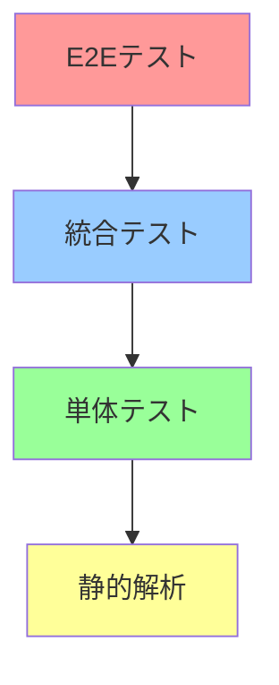

# 品質保証・テスト戦略書

## 1. 品質保証の概要

### 1.1 品質保証の目的
- 施設予約システムの信頼性確保
- ユーザーエクスペリエンスの向上
- システムの安定性・可用性の維持
- データ整合性の保証

### 1.2 品質基準
- **機能性**: 全ての機能が仕様通りに動作する
- **信頼性**: 99.9%以上の可用性を維持
- **使いやすさ**: 直感的で分かりやすいUI/UX
- **性能**: 応答時間3秒以内
- **セキュリティ**: 個人情報の適切な保護

## 2. テスト戦略

### 2.1 テストピラミッド



### 2.2 テストレベル

#### 2.2.1 単体テスト (Unit Testing)
- **対象**: 個別の関数・メソッド
- **ツール**: GAS Testing Framework, QUnit
- **実行頻度**: 開発時・コミット時

```javascript
// 単体テスト例
function testValidateReservationData() {
  // 正常データのテスト
  const validData = {
    name: "山田太郎",
    email: "yamada@example.com",
    date: "2024-12-25",
    time: "10:00",
    facility: "会議室A"
  };
  
  QUnit.test("正常な予約データの検証", function(assert) {
    assert.ok(validateReservationData(validData), "正常データは検証をパスする");
  });
  
  // 異常データのテスト
  const invalidData = {
    name: "",
    email: "invalid-email",
    date: "2024-02-30",
    time: "25:00",
    facility: ""
  };
  
  QUnit.test("異常な予約データの検証", function(assert) {
    assert.notOk(validateReservationData(invalidData), "異常データは検証で失敗する");
  });
}
```

#### 2.2.2 統合テスト (Integration Testing)
- **対象**: コンポーネント間の連携
- **範囲**: フォーム→バリデーション→データ保存→カレンダー連携
- **実行頻度**: ビルド時・リリース前

```javascript
// 統合テスト例
function testReservationFlow() {
  QUnit.test("予約フロー統合テスト", function(assert) {
    // テストデータの準備
    const reservationData = {
      name: "テストユーザー",
      email: "test@example.com",
      date: "2024-12-25",
      time: "14:00",
      facility: "会議室A",
      purpose: "会議",
      participants: "5"
    };
    
    // 1. バリデーションテスト
    assert.ok(validateReservationData(reservationData), "バリデーション通過");
    
    // 2. 重複チェックテスト
    assert.notOk(checkDuplicateReservation(reservationData), "重複なし");
    
    // 3. データ保存テスト
    const savedId = saveReservationData(reservationData);
    assert.ok(savedId, "データ保存成功");
    
    // 4. カレンダー登録テスト
    const calendarEventId = createCalendarEvent(reservationData);
    assert.ok(calendarEventId, "カレンダー登録成功");
    
    // クリーンアップ
    deleteReservationData(savedId);
    deleteCalendarEvent(calendarEventId);
  });
}
```

#### 2.2.3 E2Eテスト (End-to-End Testing)
- **対象**: ユーザーの実際の使用シナリオ
- **ツール**: Google Apps Script Test Suite
- **実行頻度**: リリース前・定期実行

```javascript
// E2Eテスト例
function testCompleteReservationScenario() {
  QUnit.test("完全な予約シナリオテスト", function(assert) {
    // シナリオ: 新規ユーザーが予約を作成
    
    // 1. フォームアクセス
    const formAccess = simulateFormAccess();
    assert.ok(formAccess.success, "フォームアクセス成功");
    
    // 2. フォーム入力
    const formData = {
      name: "E2Eテストユーザー",
      email: "e2e@example.com",
      date: "2024-12-26",
      time: "16:00",
      facility: "会議室B",
      purpose: "プレゼンテーション",
      participants: "10"
    };
    
    // 3. 送信処理
    const submitResult = simulateFormSubmit(formData);
    assert.ok(submitResult.success, "フォーム送信成功");
    
    // 4. 確認メール送信
    const emailSent = verifyConfirmationEmail(formData.email);
    assert.ok(emailSent, "確認メール送信成功");
    
    // 5. データベース確認
    const savedData = getReservationData(submitResult.id);
    assert.deepEqual(savedData, formData, "データベース保存確認");
    
    // 6. カレンダー確認
    const calendarEvent = getCalendarEvent(submitResult.calendarId);
    assert.ok(calendarEvent, "カレンダー登録確認");
    
    // クリーンアップ
    cleanupTestData(submitResult.id);
  });
}
```

## 3. テスト実装

### 3.1 テスト環境の構築

#### 3.1.1 GAS Testing Framework のセットアップ
```javascript
// test/gas-testing-framework.js
class GASTestFramework {
  constructor() {
    this.tests = [];
    this.results = [];
  }
  
  test(name, testFunction) {
    this.tests.push({
      name: name,
      function: testFunction
    });
  }
  
  run() {
    this.results = [];
    for (const test of this.tests) {
      try {
        const result = test.function();
        this.results.push({
          name: test.name,
          status: 'PASS',
          result: result
        });
      } catch (error) {
        this.results.push({
          name: test.name,
          status: 'FAIL',
          error: error.message
        });
      }
    }
    return this.results;
  }
  
  assert(condition, message) {
    if (!condition) {
      throw new Error(message || 'Assertion failed');
    }
  }
  
  assertEqual(actual, expected, message) {
    if (actual !== expected) {
      throw new Error(message || `Expected ${expected}, but got ${actual}`);
    }
  }
}

// グローバルインスタンス
const TestFramework = new GASTestFramework();
```

#### 3.1.2 テストデータの管理
```javascript
// test/test-data.js
class TestDataManager {
  constructor() {
    this.testSpreadsheetId = 'TEST_SPREADSHEET_ID';
    this.testCalendarId = 'TEST_CALENDAR_ID';
  }
  
  createTestReservation() {
    return {
      id: 'TEST_' + Date.now(),
      name: 'テストユーザー' + Math.random(),
      email: 'test' + Math.random() + '@example.com',
      date: this.getTestDate(),
      time: '10:00',
      facility: '会議室A',
      purpose: 'テスト目的',
      participants: '1'
    };
  }
  
  getTestDate() {
    const date = new Date();
    date.setDate(date.getDate() + 7); // 1週間後
    return Utilities.formatDate(date, Session.getScriptTimeZone(), 'yyyy-MM-dd');
  }
  
  cleanup() {
    // テストデータの削除
    const sheet = SpreadsheetApp.openById(this.testSpreadsheetId).getActiveSheet();
    const data = sheet.getDataRange().getValues();
    
    for (let i = data.length - 1; i >= 0; i--) {
      if (data[i][0] && data[i][0].toString().startsWith('TEST_')) {
        sheet.deleteRow(i + 1);
      }
    }
  }
}
```

### 3.2 自動テスト実行

#### 3.2.1 定期実行設定
```javascript
// test/automated-testing.js
function runAutomatedTests() {
  const testSuite = new TestSuite();
  
  // 全テストの実行
  const results = testSuite.runAll();
  
  // 結果の記録
  logTestResults(results);
  
  // 失敗時の通知
  if (results.failCount > 0) {
    sendFailureNotification(results);
  }
  
  return results;
}

function setupAutomatedTesting() {
  // トリガーの設定
  ScriptApp.newTrigger('runAutomatedTests')
    .timeBased()
    .everyDays(1)
    .atHour(2) // 深夜2時に実行
    .create();
}

function logTestResults(results) {
  const sheet = SpreadsheetApp.openById('TEST_RESULTS_SPREADSHEET_ID').getActiveSheet();
  
  sheet.appendRow([
    new Date(),
    results.totalTests,
    results.passCount,
    results.failCount,
    results.duration,
    JSON.stringify(results.failures)
  ]);
}
```

## 4. 品質メトリクス

### 4.1 コードメトリクス
- **カバレッジ**: 80%以上
- **複雑度**: 循環複雑度10以下
- **重複**: 5%以下
- **コードスタイル**: ESLint準拠

### 4.2 品質ゲート
```javascript
// 品質ゲート設定
const QUALITY_GATES = {
  testCoverage: 80,
  maxComplexity: 10,
  maxDuplication: 5,
  maxTechnicalDebt: 8 // 時間単位
};

function checkQualityGates(metrics) {
  const failures = [];
  
  if (metrics.coverage < QUALITY_GATES.testCoverage) {
    failures.push(`テストカバレッジ不足: ${metrics.coverage}% (必要: ${QUALITY_GATES.testCoverage}%)`);
  }
  
  if (metrics.complexity > QUALITY_GATES.maxComplexity) {
    failures.push(`複雑度過多: ${metrics.complexity} (上限: ${QUALITY_GATES.maxComplexity})`);
  }
  
  if (metrics.duplication > QUALITY_GATES.maxDuplication) {
    failures.push(`重複コード過多: ${metrics.duplication}% (上限: ${QUALITY_GATES.maxDuplication}%)`);
  }
  
  return {
    passed: failures.length === 0,
    failures: failures
  };
}
```

## 5. 性能テスト

### 5.1 ロードテスト
```javascript
function performLoadTest() {
  const testCases = [
    { users: 10, duration: 60 },
    { users: 50, duration: 300 },
    { users: 100, duration: 600 }
  ];
  
  const results = [];
  
  for (const testCase of testCases) {
    const result = simulateLoad(testCase.users, testCase.duration);
    results.push({
      users: testCase.users,
      duration: testCase.duration,
      averageResponseTime: result.averageResponseTime,
      errorRate: result.errorRate,
      throughput: result.throughput
    });
  }
  
  return results;
}

function simulateLoad(users, duration) {
  const startTime = Date.now();
  const responses = [];
  
  for (let i = 0; i < users; i++) {
    const userResponses = simulateUserSession(duration / users);
    responses.push(...userResponses);
  }
  
  return analyzeResponses(responses);
}
```

### 5.2 ストレステスト
```javascript
function performStressTest() {
  const maxUsers = 200;
  const stepSize = 10;
  const stepDuration = 60;
  
  const breakingPoint = findBreakingPoint(maxUsers, stepSize, stepDuration);
  
  return {
    maxSupportedUsers: breakingPoint.users,
    averageResponseTime: breakingPoint.responseTime,
    errorRate: breakingPoint.errorRate
  };
}
```

## 6. セキュリティテスト

### 6.1 脆弱性テスト
```javascript
function performSecurityTests() {
  const tests = [
    testSQLInjection,
    testXSSProtection,
    testCSRFProtection,
    testInputValidation,
    testDataEncryption
  ];
  
  const results = [];
  
  for (const test of tests) {
    try {
      const result = test();
      results.push({
        testName: test.name,
        status: 'PASS',
        result: result
      });
    } catch (error) {
      results.push({
        testName: test.name,
        status: 'FAIL',
        error: error.message
      });
    }
  }
  
  return results;
}

function testInputValidation() {
  const maliciousInputs = [
    '<script>alert("XSS")</script>',
    'DROP TABLE reservations;',
    '../../etc/passwd',
    'javascript:alert("XSS")'
  ];
  
  for (const input of maliciousInputs) {
    const result = validateReservationData({ name: input });
    if (result.valid) {
      throw new Error(`悪意のある入力が検証をパスしました: ${input}`);
    }
  }
  
  return { status: 'PASS' };
}
```

## 7. 品質監視

### 7.1 継続的監視
```javascript
function setupQualityMonitoring() {
  // 日次品質レポート
  ScriptApp.newTrigger('generateDailyQualityReport')
    .timeBased()
    .everyDays(1)
    .atHour(9)
    .create();
  
  // 週次品質分析
  ScriptApp.newTrigger('performWeeklyQualityAnalysis')
    .timeBased()
    .everyWeeks(1)
    .onWeekDay(ScriptApp.WeekDay.MONDAY)
    .atHour(10)
    .create();
}

function generateDailyQualityReport() {
  const metrics = collectQualityMetrics();
  const report = generateQualityReport(metrics);
  
  // レポートの保存
  saveQualityReport(report);
  
  // 閾値を超えた場合の通知
  if (metrics.issueCount > 0) {
    sendQualityAlert(report);
  }
}
```

## 8. 品質改善プロセス

### 8.1 品質改善サイクル
1. **測定**: 品質メトリクスの収集
2. **分析**: 問題点の特定
3. **計画**: 改善策の立案
4. **実行**: 改善の実施
5. **評価**: 効果の測定

### 8.2 品質改善アクション
```javascript
function identifyQualityIssues(metrics) {
  const issues = [];
  
  if (metrics.testCoverage < 70) {
    issues.push({
      type: 'LOW_COVERAGE',
      severity: 'HIGH',
      action: 'テストケースの追加'
    });
  }
  
  if (metrics.bugCount > 10) {
    issues.push({
      type: 'HIGH_BUG_COUNT',
      severity: 'MEDIUM',
      action: 'バグ修正の優先化'
    });
  }
  
  return issues;
}
```

## 9. 品質保証チェックリスト

### 9.1 リリース前チェック
- [ ] 全単体テストの実行・パス
- [ ] 統合テストの実行・パス
- [ ] E2Eテストの実行・パス
- [ ] 性能テストの実行・基準クリア
- [ ] セキュリティテストの実行・パス
- [ ] コードレビューの完了
- [ ] ドキュメントの更新
- [ ] 品質ゲートの通過

### 9.2 運用監視チェック
- [ ] エラーログの確認
- [ ] パフォーマンスメトリクスの監視
- [ ] ユーザーフィードバックの収集
- [ ] セキュリティアラートの監視
- [ ] 品質メトリクスの定期確認

---

**最終更新日**: 2024年12月
**バージョン**: 1.0
**管理者**: 品質保証チーム
